# GD32F103实战笔记

## 背景

​	在我入门之处，曾经请教过老师，请教过学长，看过很多帖子，大家给了各有各的方法，折腾了很久才初窥门径，所以，在这里提供一个我认为比较比较容易上手的入门步骤，如下

1. 先会使用它
2. 弄懂原理
3. 照着原理可以做一个

我力求把每个点都写的简单通俗，但是能力有限，还希望大家如有什么问题，能够发邮件（welcome_sk@126.com）给我，让我改进以便让以后的人更容易理解。

​	我相信国产芯片会越来越好，所以，芯片选择我都会采用国产芯片，例如本文芯片GD32F103。同时希望用这种方法能促进国产芯片的发展。

​	如果有国产芯片公司需要人为其编写驱动，丰富自己的例库，也可以发邮件（welcome_sk@126.com）给我，我很愿意帮忙的。

​	对了，我写的所有文档和代码都可以随便转发，包括拿去牟利，只是希望能够把我的邮箱留下，方便有问题人可以联系到我，谢谢。

## 实战1__编程规范

### 目的

​	规范是经验的积累，需要慢慢用心去体会。

### 规范

#### 1. 原则

1. 简洁明了，提高代码可读性，读的是代码而不是注释，注释永远都是辅助的。
2. 零告警，严谨的语法才能保障代码表达和编译器理解的是一至的。

#### 2. 排版

1. 缩进4空格，杜绝tab键
2. 程序块之间、变量声明之间，用空行分隔
3. 突出语法关键字
4. 一行不要太长，换行增加可读性

#### 3. 注释

1. 注释的目的是阐明意图目的，而不是翻译某行代码的动作
2. 注释的原则是尽量代码自注释，代码越清晰，可读性越高
3. 统一格式 /* 注释内容 */， *号与注释内容之间有一个空格

#### 4. 定义

1. 命名风格

   1. 模块名+文件名+功能描述，之间采用短下划线分隔
   2. 功能描述部分，采用驼峰风格

   例如，

   ```c
   VOID OS_TASK_TaskDelay(IN U16 ms);
   ```

2. 宏定义

   1. define 必须大写
   2. typedef 可以小写

   例如，

   ```c
   #define OS_TASK_SWITCH_INTERVAL 10 /* 单位ms */
   typedef U32 StackSize_t；  /* 仅用于堆栈 */
   ```

3. 类型定义

   统一使用下面的，编程最关心符号位和位宽

   ```c
   #define U8  unsigned char
   #define S8  char
   #define U16 unsigned short
   #define S16 short
   #define U32 unsigned int
   #define S32 int
   #define U64 unsigned long long
   #define S64 long long
   #define VOID void
   #define BOOL unsigned char
   
   #define TRUE 1
   #define FALSE 0
   #define NULL 0
   ```

#### 5. 变量

1. 局部变量
   1. 在函数开始是全部定义，不允许在函数中间定义
   2. 命名必须能传达该变量使用的意图
   3. 必须初始化
2. 全局变量
   1. 在C文件中，函数之前统一定义
   2. 命名必须能传达该变量的使用意图，且以g开头
   3. 本地全局变量必须用static关键字
   4. 开发给外部使用的全局变量，必须在头文件中声明，且使用extern关键字
   5. 必须初始化

#### 6. 函数

1. 函数名必须能够自注释，必要是需要增加注释写明意图
2. 参数必须使用IN、OUT、INOUT指明出入参类型
3. 内部函数必须使用static定义，命名可以不加模块名
4. 外部函数
   1. 必须在头文件中声明，
   2. 必须使用extern关键字，
   3. 命名时必须带模块名，
   4. 必须给出带注释，并写明函数意图，参数说明，返回值

#### 7. 文件

1. 头文件

   1. 命名规则模块名+功能，小写，例如os_task.h

   2. 格式如下

      ```c
      #ifndef __OS_TASK_H__
      #define __OS_TASK_H__
      
      ..../* 开放的宏定义 */
      ..../* 开放的全局变量声明 */
      ..../* 开放的函数声明 */
      
      #endif
      ```

2. 源文件

   1. 命名规则模块名+功能，小写，例如os_task.c

   2. 格式如下，举例只为说明源文件中，各元素的顺序

      ```c
      <- 1 - 引用头文件 ->
      #include "os_task.h"
      
      <- 2 - 定义本文件用到的宏 ->
      #define OS_TASK_SWITCH_INTERVAL 10 /* 单位ms */
      typedef U32 StackSize_t ；  /* 仅用于堆栈 */
      typedef enum{};
      typedef struct{};
      
      <- 3 - 静态全局变量 ->
      static StackSize_t *gTopStack = NULL；
      
      <- 4 - 本模块开放的全局变量 ->
      U32 gOsTaskEventBitMap = 0; 
      
      <- 5 - 本地函数，仅在本文件使用 ->
      static VOID TASK_TaskSwitch(VOID)
      {
          return；
      }
      
      <- 6 - 本模块开放的函数 ->
      VOID OS_TASK_TaskDelay(IN U16 ms)
      {
       	return；   
      }
      ```

#### 8. 模块

1. 模块必须具有封装性，且对外提供尽量少的必要接口，接口必须提供详细的注释描述

2. 模块的组织形式可以是文件夹形式，也可以是文件形式

   例如：

   ```c
   .
   ├── app /* 应用层代码 */
   │   ├── app.h 
   │   ├── main.c /* 应用入口 */
   │   ├── test.c
   │   └── test.h
   ├── driver /* 设备驱动代码 */
   │   ├── drv_led.c
   │   ├── drv_led.h
   │   ├── drv_uart.c
   │   └── drv_uart.h
   ├── os  /* 操作系统代码 */
   │   ├── os_task.c
   │   ├── os_task.h
   │   └── os_type.h
   ├── sdk /* 芯片厂家提供的库代码 */
   │   ├── CMSIS
   │   └── Peripherals
   ```


## 实战2__如何创建一个Keil工程

1. 创建一个工程，按图中标号操作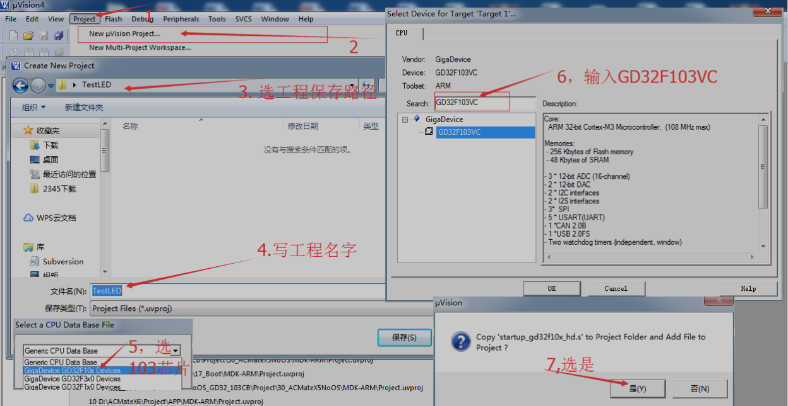

2. 按图并配置工程，并添加源文件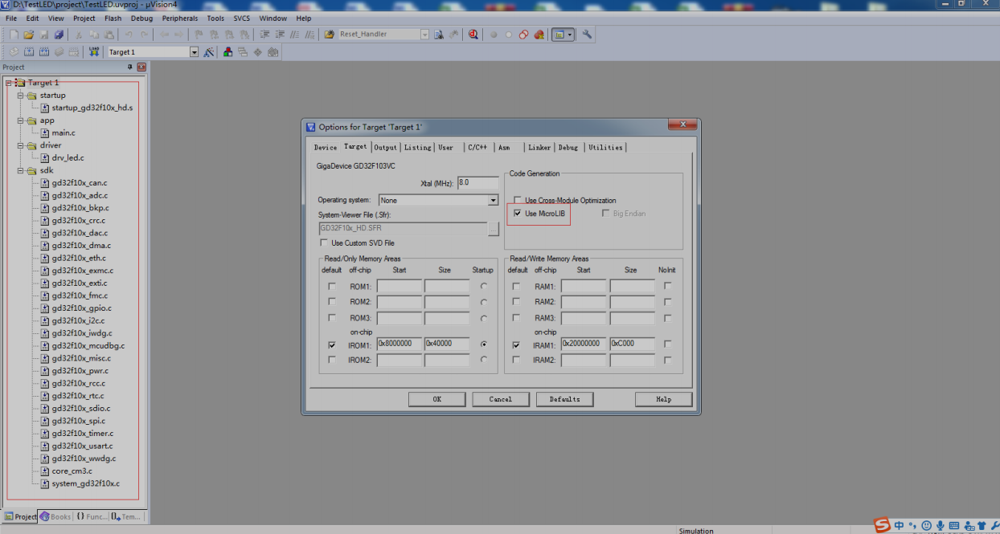

3. 按图添加头文件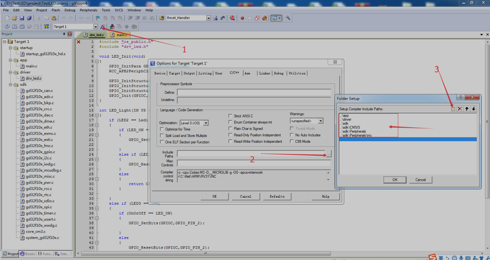

4. 在main.c文件中增加如下代码

   ```c
   int main()
   {
   	return 0;
   }
   
   ```

5. 点击编译，编译信息提示编译通过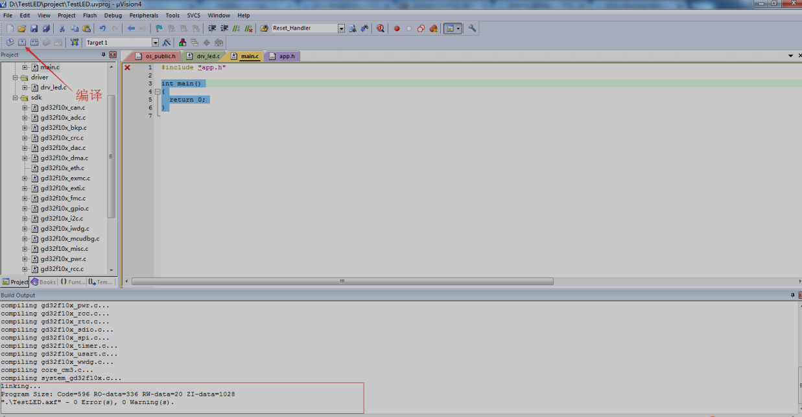


## 实战3__点亮LED灯

### 知识点

#### 1. GPIO控制

#### 2. LED灯驱动原理

#### 3. 按键检查原理

### 硬件部分

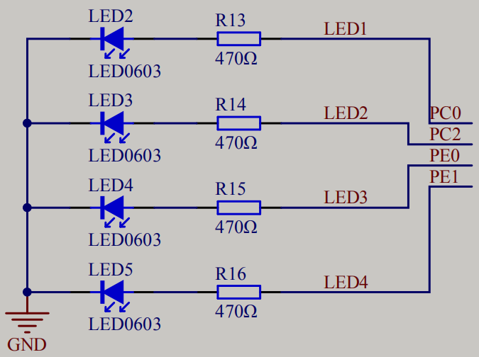

如上图，LED灯负极接地，正极通过470欧电阻后，接到了MCU的引脚上。可以看出，当MCU的GPIO口输出

高电平时LED亮，

低电平时LED灭。

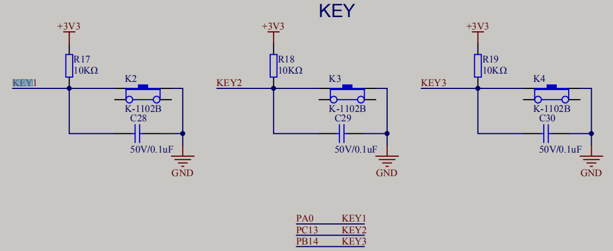

如上图，

​	当按键弹起时，GPIO接在3.3V上，为高电平

​	当按键按下时，GPIO接到地上，为低电平

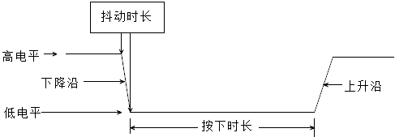

注意：

1. 原理图中的K1,K2,K3分别对应板子上的K2,K3,K4，本文都是按原理图描述
2. 0.1uF电容作用去抖动

### 功能设计

​	设计一个小功能，KEY3按下 4个LED灯亮，弹起时4个LED灭。子功能设计包括，

#### 1. 功能状态设计

​	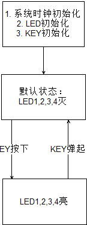

​	如上图，该功能一共要经历上面几个状态，从而也就明白我们需要提供哪些功能函数，细节读下面的代码。

```c
static VOID LED_Init(VOID)
{
    DRV_LED_Init();
    DRV_KEY_Init();
}

static VOID LED_SetLedStatus(IN U8 status)
{
    if (DRV_KEY_DOWN == status)
    {
        DRV_LED_On(DRV_LED1);
        DRV_LED_On(DRV_LED2);
        DRV_LED_On(DRV_LED3);
        DRV_LED_On(DRV_LED4);
    }
    else if (DRV_KEY_UP == status)
    {
        DRV_LED_Off(DRV_LED1);
        DRV_LED_Off(DRV_LED2);
        DRV_LED_Off(DRV_LED3);
        DRV_LED_Off(DRV_LED4);
    }
    else
    {
        ;
    }
}

static VOID LED_CheckKeyStatus(VOID)
{
    U8 keyStatus = 0;
    
    keyStatus = DRV_KEY_GetStatus(DRV_KEY3);
    if (DRV_KEY_DOWN == keyStatus)
    {
        APP_Delay(50); /* 50ms去抖动 */
        keyStatus = DRV_KEY_GetStatus(DRV_KEY3);
        if (DRV_KEY_DOWN == keyStatus)
        {
            LED_SetLedStatus(DRV_KEY_DOWN);
        }
    }
    else
    {
        LED_SetLedStatus(DRV_KEY_UP);
    }
}

VOID APP_LED_Test(VOID)
{
    LED_Init();
    LED_SetLedStatus(DRV_KEY_UP);
    
    while (1)
    {
        LED_CheckKeyStatus();
    }
}
```

#### 2. 定时器设计

 	1. 采用systick作为功能定时器，初始配置成1ms一次中断
		2. 提供delay延时函数

```c
static U32 gDrvSystickDelayCount = 0;

S32 DRV_SYSTICK_Init(VOID)
{
    /* 1000Hz,1ms中断一次 */
    if (SysTick_Config(SystemCoreClock / 1000))
    {
        return OS_ERROR;
    }
    
    NVIC_SetPriority(SysTick_IRQn, 0x00);

    return OS_OK;
}

/* 1ms中断一次 */
VOID SysTick_Handler(VOID)
{
    if (gDrvSystickDelayCount > 0)
    {
        gDrvSystickDelayCount--;
    }
}

VOID DRV_SYSTICK_Delay(IN U32 ms)
{
    gDrvSystickDelayCount = ms;
    while (1)
    {
        if (gDrvSystickDelayCount <= 0)
        {
            break;
        }
    }

    return;
}
```

#### 3. LED驱动

1. 提供初始化函数接口
2. 提供LED on/off接口

```c
#define DRV_LED1 GPIOC,GPIO_PIN_0
#define DRV_LED2 GPIOC,GPIO_PIN_2
#define DRV_LED3 GPIOE,GPIO_PIN_0
#define DRV_LED4 GPIOE,GPIO_PIN_1
#define DRV_LED_On(led) GPIO_SetBits(led);
#define DRV_LED_Off(led) GPIO_ResetBits(led);

extern void DRV_LED_Init(void);
```

#### 4. 按键驱动

1. 提供初始化接口
2. 提供获取按键状态接口

```c
#define DRV_KEY3 GPIOB, GPIO_PIN_14
#define DRV_KEY_GetStatus(key) GPIO_ReadInputBit(key)
#define DRV_KEY_DOWN 0
#define DRV_KEY_UP 1

extern VOID DRV_KEY_Init(VOID);
```

### 总结

IO配置总结（配置时钟(必配)-->选择复用(选配)-->选择模式(必配)-->配置速率(必配)）：

  1. 判断是GPIO（通用IO）和AFIO（复用IO），可以从datasheet的PIN definition章节查到，如图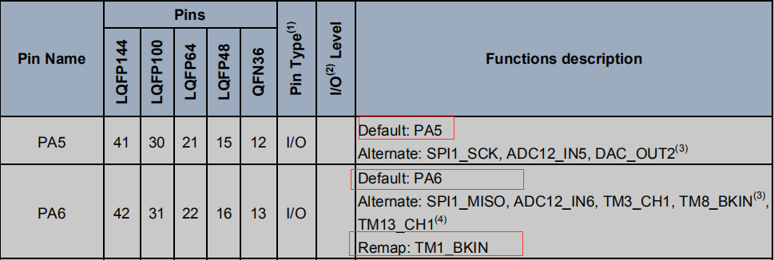default是作为普通GPIO口配置，remap（复用）可以作为TM1_BKIN

  2. IO作为普通GPIO口使用，配置流程如下：
       1. 配置GPIO时钟，由下图可以看出，GPIO挂在APB2上，所以，配置代码如下`RCC_APB2PeriphClock_Enable(RCC_APB2PERIPH_GPIOC |RCC_APB2PERIPH_GPIOE,ENABLE);`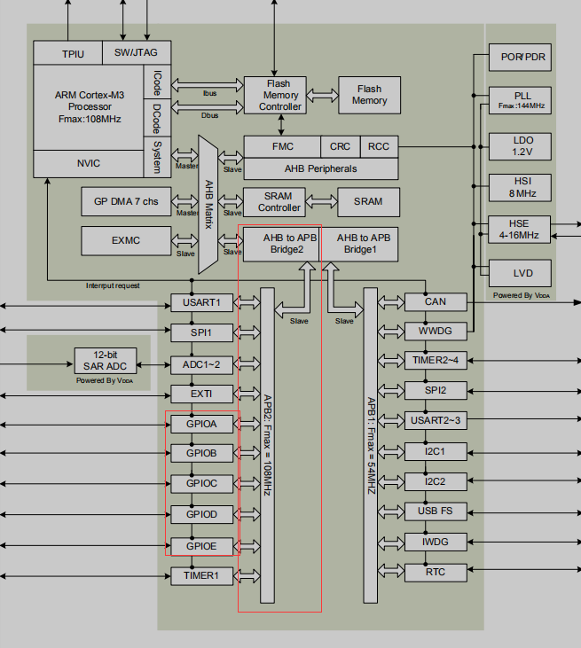

       2. 配置GPIO方向、模式和速率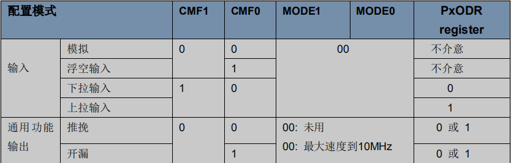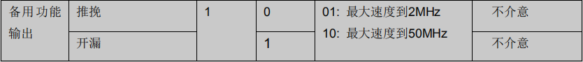如上图几种方式，配置代码如下，注意，输入时速率硬件已经配置好了，软件不需要配置

          ```c
          GPIO_InitPara GPIO_InitStructure;
          
          /* 上拉输出，50MHz */
          GPIO_InitStructure.GPIO_Pin = GPIO_PIN_0 | GPIO_PIN_2;
          GPIO_InitStructure.GPIO_Mode = GPIO_MODE_OUT_PP;
          GPIO_InitStructure.GPIO_Speed = GPIO_SPEED_50MHZ;
          GPIO_Init(GPIOC,&GPIO_InitStructure);
          
          /* 浮空输入 */
          GPIO_InitStructure.GPIO_Pin = GPIO_PIN_14;
          GPIO_InitStructure.GPIO_Mode = GPIO_MODE_IN_FLOATING;
          GPIO_Init(GPIOB,&GPIO_InitStructure);
          ```

       3. 配置GPIO口中断，参考中断章节

  3. AFIO remap流程，先使能AF时钟，再调用pinRemap函数重新映射即可

     ```c
     RCC_APB2PeriphClock_Enable(RCC_APB2PERIPH_AF, ENABLE);
     GPIO_PinRemapConfig(GPIO_REMAP_SWJ_DISABLE, ENABLE);
     ```

### 参考资料

《GD32F10xCH_V1.1.pdf》

《GD32103C-EVAL-V1.1.pdf》

《GD32F103xxDatasheetRev2.2.pdf》


## 实战4__调试模块

### 前言

​	记住，要实现一个功能前，应该先想好应该怎么调试该功能，并为其准备好完备的调试手段。

​	串口打印log信息是最常见的调试手段，下面我要实现该调试手段。

​	其中，串口的相关知识将在串口章节补充。

### 功能设计

功能要求如下：

1. 打印分类标签，包括trace, errror, debug
2. 打印文件名+行号
3. 打印关键提示信息和参数

### 功能实现

1. 串口初始化

   ```c
   static VOID UART1_GpioInit(VOID)
   {
       GPIO_InitPara GPIO_InitStructure;
       
       RCC_APB2PeriphClock_Enable(RCC_APB2PERIPH_GPIOA , ENABLE);
       
       GPIO_InitStructure.GPIO_Pin     = GPIO_PIN_9 ;
       GPIO_InitStructure.GPIO_Mode    = GPIO_MODE_AF_PP;
       GPIO_InitStructure.GPIO_Speed   = GPIO_SPEED_50MHZ;
       GPIO_Init( GPIOA , &GPIO_InitStructure); 
       GPIO_InitStructure.GPIO_Pin     = GPIO_PIN_10;
       GPIO_InitStructure.GPIO_Mode    = GPIO_MODE_IN_FLOATING;;
       GPIO_Init( GPIOA , &GPIO_InitStructure); 
   }
   
   static VOID UART1_Config(VOID)
   {
       USART_InitPara USART_InitStructure;
       
       RCC_APB2PeriphClock_Enable(RCC_APB2PERIPH_USART1 , ENABLE);
       
       USART_DeInit( USART1 );
       USART_InitStructure.USART_BRR = 115200;  /* 波特率 */
       USART_InitStructure.USART_WL = USART_WL_8B; /* 数据位 */
       USART_InitStructure.USART_STBits = USART_STBITS_1; /* 停止位 */
       USART_InitStructure.USART_Parity = USART_PARITY_RESET; /* 校验位 */
       USART_InitStructure.USART_HardwareFlowControl = USART_HARDWAREFLOWCONTROL_NONE; /* 流控 */
       USART_InitStructure.USART_RxorTx = USART_RXORTX_RX | USART_RXORTX_TX; /* 收发使能 */
       USART_Init(USART1, &USART_InitStructure);
   }
   
   VOID DRV_UART1_Init(VOID)
   {
       UART1_GpioInit();
       UART1_Config();
       USART_Enable(USART1, ENABLE);
   }
   ```

2. printf实现

   原理是printf最终会调用putchar函数，所以我们把putchar函数实现了即可。

   ```c
   #ifdef __GNUC__
       /* With GCC/RAISONANCE, small printf (option LD Linker->Libraries->Small printf
          set to 'Yes') calls __io_putchar() */
       #define PUTCHAR_PROTOTYPE int __io_putchar(int ch)
   #else
       #define PUTCHAR_PROTOTYPE int fputc(int ch, FILE *f)
   #endif /* __GNUC__ */
   
   PUTCHAR_PROTOTYPE
   {
       /* 等待发送完成 */
       while (USART_GetBitState(USART1 , USART_FLAG_TBE) == RESET)
       {
       }
       
       USART_DataSend(USART1 , (U8)ch);
       
       while (USART_GetBitState(USART1 , USART_FLAG_TC) == RESET)
       {
       }
       return ch;
   }
   ```

3. 调试宏实现

```c
#define	APP_ERROR(fmt, ...) do {printf("[ERROR][%s,%d]: " fmt "\n", __FUNCTION__, __LINE__, ##__VA_ARGS__);} while(0)
#define	APP_TRACE(fmt, ...) do {printf("[TRACE][%s,%d]: " fmt "\n", __FUNCTION__, __LINE__, ##__VA_ARGS__);} while(0)
#define	APP_DEBUG(fmt, ...) do {printf("[DEBUG][%s,%d]: " fmt "\n", __FUNCTION__, __LINE__, ##__VA_ARGS__);} while(0)
```

### 使用举例

如下图，在LED的例子测试，效果如图

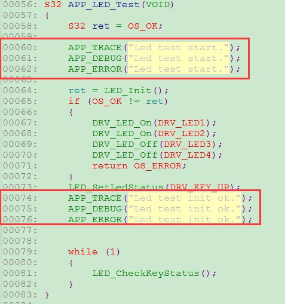

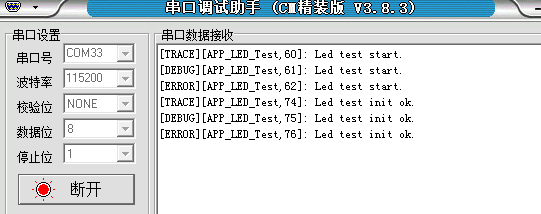


## 实战5__状态机

### 引子

​	上面的点灯例子中，如果想要实现如下功能，使用状态机可以把代码写的简洁通透。

1. 按一下全亮
2. 再按一下亮度降低50%
3. 再按一下跑马灯
4. 长按3秒熄灭

### 状态机设计

​	我们把上面的功能在分解下，如下：

1. 按键检测，如图
   1. 按下，低电平
   2. 弹起，高电平
   3. 按下时间长，可用作区分短按还是长按
   4. 触发方式，高电平触发，低电平触发，下降沿触发，上升沿触发，根据经验，牵扯到时长判断，触发方式最好选择上升沿触发

   

2. 灯状态
   1. 全亮
   2. 50%亮度
   3. 跑马灯状态
   4. 全灭

   总结，可以设计如下图的两个小状态机相互切换。

   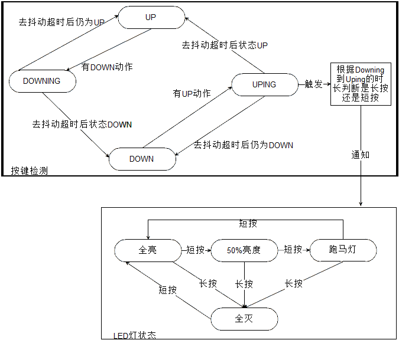

### 功能实现

#### 按键检测

​	状态迁移如上图，代码如下，功能与上图描述一一对应。

```c
#define APP_KEY_JITTERTIME 50 /* 50ms */
#define APP_KEY_LONGPRESSTIME 3000 /* 3s */

typedef enum
{
    KEY_SMSTATUS_UP = 0,
    KEY_SMSTATUS_UPING,
    KEY_SMSTATUS_DOWN,
    KEY_SMSTATUS_DOWNING,
    KEY_SMSTATUS_BUTT
}KeySmStatus_e;

typedef struct
{ 
    KeySmStatus_e smStatus;     /* up-->downing-->down-->uping-->up */
    U64 downingMoment;  
    U64 jitterTimeBegin;
}KeySm_t;

static KeySm_t gKeySm;

static VOID KEY_SmStatusUp(VOID)
{
    U8 keyStatus = 0;

    if (KEY_SMSTATUS_UP != gKeySm.smStatus)
    {
        return;
    }
    
    keyStatus = DRV_KEY_GetStatus(DRV_KEY3);
    if (DRV_KEY_DOWN == keyStatus)
    {
        gKeySm.smStatus = KEY_SMSTATUS_DOWNING;
        gKeySm.jitterTimeBegin = APP_TimeMs();
        APP_TRACE("up --> downing");
    }
}

static VOID KEY_SmStatusDowning(VOID)
{
    U64 currentTime = 0;
    U8 keyStatus = 0;

    if (KEY_SMSTATUS_DOWNING != gKeySm.smStatus)
    {
        return;
    }
    
    currentTime = APP_TimeMs();
    if (currentTime < (gKeySm.jitterTimeBegin + APP_KEY_JITTERTIME))
    {
        return;
    }
    
    keyStatus = DRV_KEY_GetStatus(DRV_KEY3);
    if (DRV_KEY_DOWN == keyStatus)
    {
        gKeySm.smStatus = KEY_SMSTATUS_DOWN;
        gKeySm.downingMoment = APP_TimeMs();
        APP_TRACE("downing --> down");
    }
    else if (DRV_KEY_UP == keyStatus)
    {
        gKeySm.smStatus = KEY_SMSTATUS_UP;
        APP_TRACE("downing --> up");
    }
    else
    {
        APP_ERROR("");
    }
}

static VOID KEY_SmStatusDown(VOID)
{
    U8 keyStatus = 0;
    
    if (KEY_SMSTATUS_DOWN != gKeySm.smStatus)
    {
        return;
    }
    
    keyStatus = DRV_KEY_GetStatus(DRV_KEY3);
    if (DRV_KEY_UP == keyStatus)
    {
        gKeySm.smStatus = KEY_SMSTATUS_UPING;
        gKeySm.jitterTimeBegin = APP_TimeMs();
        APP_TRACE("down --> uping");
    }
}

static VOID KEY_SmStatusUping(VOID)
{
    U64 currentTime = 0;
    U8 keyStatus = 0;
    
    if (KEY_SMSTATUS_UPING != gKeySm.smStatus)
    {
        return;
    }

    currentTime = APP_TimeMs();
    if (currentTime < (gKeySm.jitterTimeBegin + APP_KEY_JITTERTIME))
    {
        return;
    }

    keyStatus = DRV_KEY_GetStatus(DRV_KEY3);
    if (DRV_KEY_DOWN == keyStatus)
    {
        gKeySm.smStatus = KEY_SMSTATUS_DOWN;
        APP_TRACE("uping --> down");
    }
    else if (DRV_KEY_UP == keyStatus)
    {
        gKeySm.smStatus = KEY_SMSTATUS_UP;
        currentTime = APP_TimeMs();
        if (currentTime >= (gKeySm.downingMoment + APP_KEY_LONGPRESSTIME))
        {
            APP_DEBUG("long press.");
            APP_LED_SmSwitch4LongPress();
        }
        else
        {
            APP_DEBUG("short press.");
            APP_LED_SmSwitch4ShortPress();
        }
        
        APP_TRACE("uping --> up");
    }
    else
    {
        APP_ERROR("");
    }
}

VOID APP_KEY_Loop(VOID)
{
    KEY_SmStatusUp();
    KEY_SmStatusDowning();
    KEY_SmStatusDown();
    KEY_SmStatusUping();
}
```


#### 按键通知LED接口

```c
VOID APP_LED_SmSwitch4LongPress(VOID)
{
    if (LED_SMSTATUS_OFF != gLedSm.smStatus)
    {
        gLedSm.smStatus = LED_SMSTATUS_OFF;
    }
}

VOID APP_LED_SmSwitch4ShortPress(VOID)
{
    switch (gLedSm.smStatus)
    {
        case LED_SMSTATUS_OFF:
            gLedSm.smStatus = LED_SMSTATUS_ON;
            break;
        case LED_SMSTATUS_ON:
            LED_DoHalfBrightInit();
            gLedSm.smStatus = LED_SMSTATUS_HALFBRIGHT;
            break;
        case LED_SMSTATUS_HALFBRIGHT:
            LED_DoWaterfallBrightInit();
            gLedSm.smStatus = LED_SMSTATUS_WATERFALL;
            break;
        case LED_SMSTATUS_WATERFALL:
            gLedSm.smStatus = LED_SMSTATUS_ON;
            break;
        default:
            APP_ERROR("error sm status.");
            break;
    }
}
```

#### LED灯状态迁移

 	与上图中描述完全一致。

```c
typedef enum
{
    LED_SMSTATUS_OFF = 0,
    LED_SMSTATUS_ON,
    LED_SMSTATUS_HALFBRIGHT,
    LED_SMSTATUS_WATERFALL,
    LED_SMSTATUS_BUTT
}LedSmStatus_e;

typedef struct
{
    LedSmStatus_e smStatus;
    LedSmStatus_e currentStatus;
}LedSm_t;

static LedSm_t gLedSm;

static VOID LED_LightOn(VOID)
{
    if ((LED_SMSTATUS_ON != gLedSm.smStatus) ||
        (LED_SMSTATUS_ON == gLedSm.currentStatus))
    {
        return;
    }

    APP_TRACE("light on.");
    DRV_LED_On(DRV_LED1);
    DRV_LED_On(DRV_LED2);
    DRV_LED_On(DRV_LED3);
    DRV_LED_On(DRV_LED4);
    
    gLedSm.currentStatus = LED_SMSTATUS_ON;
}

static VOID LED_HalfBright(VOID)
{
    if (LED_SMSTATUS_HALFBRIGHT != gLedSm.smStatus)
    {
        return;
    }

    APP_TRACE("light half.");
    LED_DoHalfBright();
    gLedSm.currentStatus = LED_SMSTATUS_HALFBRIGHT;
}

static VOID LED_WaterfallBright(VOID)
{
    if (LED_SMSTATUS_WATERFALL != gLedSm.smStatus)
    {
        return;
    }

    APP_TRACE("light waterfall.");
    LED_DoWaterfallBright();
    gLedSm.currentStatus = LED_SMSTATUS_WATERFALL;
}

static VOID LED_LightOff(VOID)
{
    if ((LED_SMSTATUS_OFF != gLedSm.smStatus) ||
        (LED_SMSTATUS_OFF == gLedSm.currentStatus))
    {
        return;
    }

    APP_TRACE("light off.");
    DRV_LED_Off(DRV_LED1);
    DRV_LED_Off(DRV_LED2);
    DRV_LED_Off(DRV_LED3);
    DRV_LED_Off(DRV_LED4);
    
    gLedSm.currentStatus = LED_SMSTATUS_OFF;
}

VOID APP_LED_Loop(VOID)
{
    LED_LightOn();
    LED_HalfBright();
    LED_WaterfallBright();
    LED_LightOff();
}
```

#### LED灯亮度控制

​	通过控制LED快速闪烁，调节亮灭的时间占空比实现的，如下

```c
static VOID LED_DoHalfBright(VOID)
{
    U64 time = 0;

    time = APP_TimeMs();
    if (time > gLightOnMoment + APP_LED_HALFLIGHT_TIME)
    {
        gLightOnMoment = APP_TimeMs();
        gLightCount++;
    }
    else
    {
        return;
    }
    
    if (1 == gLightCount)
    {
        DRV_LED_On(DRV_LED1);
        DRV_LED_On(DRV_LED2);
        DRV_LED_On(DRV_LED3);
        DRV_LED_On(DRV_LED4);
    }
    else
    {
        DRV_LED_Off(DRV_LED1);
        DRV_LED_Off(DRV_LED2);
        DRV_LED_Off(DRV_LED3);
        DRV_LED_Off(DRV_LED4);
    }

    /* 调节亮度 */
    if (3 == gLightCount)
    {
        gLightCount = 0;
    }
}
```

#### 跑马灯

​	即每个灯一次亮灭，如下

```c
static VOID LED_DoWaterfallBright(VOID)
{
    U64 time = 0;

    time = APP_TimeMs();
    if (time > gLightOnMoment + APP_LED_WATERFALL_TIME)
    {
        gLightOnMoment = APP_TimeMs();
        gLightCount++;
    }
    else
    {
        return;
    }

    if (1 == gLightCount)
    {
        DRV_LED_On(DRV_LED1);
        DRV_LED_Off(DRV_LED2);
        DRV_LED_Off(DRV_LED3);
        DRV_LED_Off(DRV_LED4);
    }
    
    if (2 == gLightCount)
    {
        DRV_LED_Off(DRV_LED1);
        DRV_LED_On(DRV_LED2);
        DRV_LED_Off(DRV_LED3);
        DRV_LED_Off(DRV_LED4);
    }
    
    if (3 == gLightCount)
    {
        DRV_LED_Off(DRV_LED1);
        DRV_LED_Off(DRV_LED2);
        DRV_LED_On(DRV_LED3);
        DRV_LED_Off(DRV_LED4);
    }
    
    if (4 == gLightCount)
    {
        DRV_LED_Off(DRV_LED1);
        DRV_LED_Off(DRV_LED2);
        DRV_LED_Off(DRV_LED3);
        DRV_LED_On(DRV_LED4);
        gLightCount = 0;
    }
}
```

### 总结

1. 在“点亮LED灯”例子中，按键的去抖动是要完全占用CPU，阻塞其它功能运行的，用状态机可以实现非阻塞去抖动，且代码量结构清晰代码量极少。
2. 代码中的trace、debug、error信息是在编码的时候就考虑到该如何跟踪调试该代码，实际调试中效果非常明显。
3. 由于MCU资源的限制，一般不会增加操作系统，并行处理，同步处理，异步处理，非阻塞实现，都要靠状态机实现，实现一个优美简洁的状态机，是功能可靠稳定的前提。
4. 在前面的例子时，就把驱动（driver）和应用（app）模块化，在本例中受益很大，如果细心比较本例代码和其它例子代码，可以发现除了应用（app）部分代码被重写之外，其它代码都没做任何改动，继承性非常好，省去了驱动代码的编码调试工作。


## 实战6__串口读写

### 目的

​	串口通信是非常非常常见的一种通信方式，必须掌握的。可以从如下几个方面掌握串口通信：

1. 串口通信原理，此处我们只研究异步串口
2. GD32常见的几种串口通信配置

### 异步串口通信原理

#### 	1. 配置

​	在了解原理之前，我们先看看串口要如何使用，如下图，只要选择正确的串口号，把收发双方的波特率、校验位、数据位、停止位配置成一致，这么就可以实现双方通信。

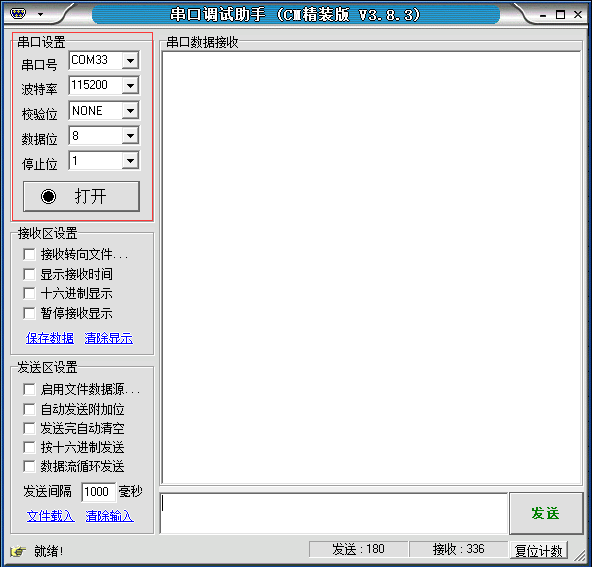

那么配置的这些参数分别代表什么意思呢？

串口号：唯一标识一个串口，当设备存在多个串口时，可以用其标识每个串口。

波特率：每秒钟传输的数据位数。表示数据传输的速率，单位bps（位每秒）。比如115200bps就表示1s可以传输115200bits的数据。 

校验位:

​	even    每个字节传送整个过程中bit为1的个数是偶数个（校验位调整个数）
​	odd     每个字节穿送整个过程中bit为1的个数是奇数个（校验位调整个数）
​	none   没有校验位
​	space  校验位总为0
​	mark   校验位总为1

数据位：5678共4个选择，这是历史原因，如下

​	5：用于电报机传26个英文字母，5位足以

​	6：用于电报机，识别大小写字母，增加一个大小写位

​	7：用于电脑，ASCII码7位

​	8：用于电脑，DBCS码用于兼容ASCII和支持中文双字节

停止位：

​	停止位是按长度来算的。串行异步通信从计时开始，以单位时间为间隔（一个单位时间就是波特率的倒数），依次接受所规定的数据位和奇偶校验位，并拼装成一个字符的并行字节；此后应接收到规定长度的停止位“1”。所以说，停止位都是“1”，1.5是它的长度，即停止位的高电平保持1.5个单位时间长度。一般来讲，停止位有1，1.5，2个单位时间三种长度。 

#### 2. 帧格式	

​	下面我们看下串行协议的帧格式，如图

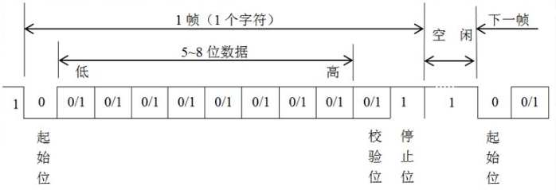

一个帧由4部分组成，起始位+数据位+校验位+停止位，正好跟上面的配置一一对应，其中，起始位必须是低电平，停止位必须是高电平。

至此，也大致明白串口是怎么回事了。

#### 3. 常见的串口电平标准

​	下面几种都是串口，只是电平标准不同，导致其应用场景存在差异，通信协议和配置都是相同的，通信原理是相同的，软件实现相同，硬件电路存在差异。

TTL：

1. 接线方式如图
2. 高电平表示逻辑1， 低电平表示逻辑零

		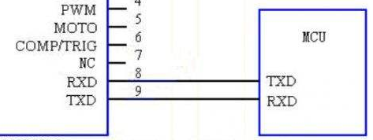

RS232和RS485对比

1. 抗干扰性：RS485 接口是采用平衡驱动器和差分接收器的组合，抗噪声干扰性好。RS232 接口使用一根信号线和一根信号返回线而构成共地的传输形式，这种共地传输容易产生共模干扰。
2. 传输距离：RS485 接口的最大传输距离标准值为 1200 米（9600bps 时），实际上可达 3000 米。RS232 传输距离有限，最大传输距离标准值为 50 米，实际上也只能用在 15 米左右。
3. 通信能力：RS-485 接口在总线上是允许连接多达128个收发器，用户可以利用单一的 RS-485 接口方便地建立起设备网络。RS-232只允许一对一通信。
4. 传输速率：RS-232传输速率较低，在异步传输时，波特率为 20Kbps。RS-485 的数据最高传输速率为 10Mbps 。
5. 信号线：RS485 接口组成的半双工网络，一般只需二根信号线。RS-232 口一般只使用 RXD、TXD、GND 三条线 。
6. 电气电平值：RS-485的逻辑"1"以两线间的电压差为+（2-6） V 表示；逻辑"0"以两线间的电压差为-（2-6）V 表 示 。在 RS-232-C 中任何一条信号线的电压均为负逻辑关系。即：逻辑"1"，-5- -15V；逻辑"0 " +5- +15V 。

#### 4. 芯片如何实现串口功能

​	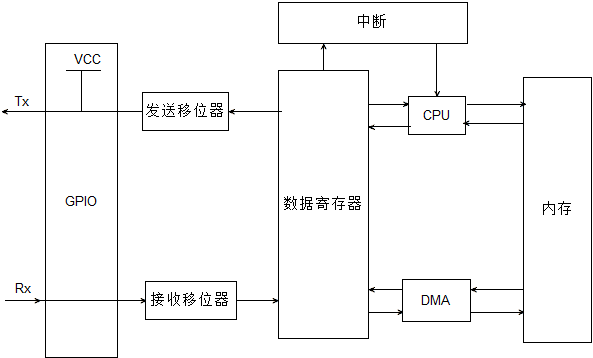

​	我们知道串口的作用是为CPU和其它设备之间提供通信，本质上是把数据从其他设备搬移到自身MCU的内存中去，如上图，MCU为实现串口功能会做如上的模块划分。

 1. GPIO

    串口总线状态，默认是高电平，所以Tx应该是上拉输出，Rx应该是浮空输入。

 2. 移位器

    我们知道串口是一位位传输的，所以移位器即可以实现串口的收发。

 3. 数据寄存器

    用于存储将要发送和接收的数据，其实只要收发共用一个字节就足以。

 4. 时钟

    上述的运行过程都需要在固定时钟下才能正确运行，例如波特率。

 5. 数据由寄存器搬移到内存

    1. CPU方式，由CPU控制数据如何在数据寄存器和内存之间进行转移，例如当数据寄存器空时，将内存转移到数据寄存器中，即发送过程
    2. DMA方式，过程同CPU，那为什么还有有DMA呢？因为数据搬移省去CPU的参与，也就意味着CPU可以去忙其它事情，效率自然就高了。

 6. 状态寄存器

    1. 我们粗略的思考下，在整个串口的传输过程中，肯定会有各式各样的状态，例如，收到数据，数据异常，帧错误，数据发送完毕，数据寄存器空了等等，这些都需要状态寄存器存储。
    2. 再深入思考下，当我们需要及时的处理上述状态时，靠CPU轮询显然太慢了，所以肯定需要中断，再增加一组中断状态寄存器。

 7. 配置寄存器

    ​	上述情况那么多，代表不同的配置，肯定需要几组配置寄存器。例如，中断的使能控制等

### 功能设计

​	如果明白了原理，那么自然就知道该如何配置一个串口了，无非就是从芯片手册中找到相应的寄存器进行配置而已。

​	在”串口发送“例子中，已经接触了串口的发送功能，现在我们把这个例子再度深入，实现串口的接收功能。实现一个回显功能，即PC通过串口向GD32写入数据，然后GD32把数据原封不动返回给PC。

##### 轮询方式

```c
VOID DRV_UART1_PollTest(VOID)
{
    U8 ch = 0;
    
    while (1)
    {
        if (USART_GetBitState(USART1, USART_FLAG_RBNE) != RESET)
        {
            ch = (U8)USART_DataReceive(USART1);
            UART1_SendChar(ch);
        }
    }
}

VOID DRV_UART1_PollInit(VOID)
{
    UART1_GpioInit();
    UART1_Config();
    USART_Enable(USART1, ENABLE);
}
```

效果如图


##### 中断方式

注：中断优先级部分，我会抽单独章节分析。

必须注意下面这两个函数的区别，

```c
USART_GetBitState(USART1, USART_FLAG_RBNE)； /* 非中断使用 */
USART_GetIntBitState(USART1, USART_INT_RBNE);/* 中断内使用 */
```

中断方式处理代码如下：

```c
VOID USART1_IRQHandler(VOID)
{
    if (USART_GetIntBitState(USART1, USART_INT_RBNE) != RESET)
    {
        if (gUart1RxCount >= DRV_UART1_BUFLEN)
        {
            memset(gUart1RxBuf, 0, sizeof(gUart1RxBuf));
            gUart1RxCount = 0;
        }
        gUart1RxBuf[gUart1RxCount] = (U8)USART_DataReceive(USART1);
        gUart1RxCount++;
    }

    if (USART_GetIntBitState(USART1, USART_INT_IDLEF) != RESET)
    {
        gUart1RxBufFlag++;
    }
}

VOID DRV_UART1_InterruptTest(VOID)
{
    U8 rxCount = 0;

    while (1)
    {
        if (gUart1RxBufFlag > 0)
        {
            for (rxCount = 0; rxCount < gUart1RxCount; rxCount++)
            {
                UART1_SendChar(gUart1RxBuf[rxCount]);
            }
            memset(gUart1RxBuf, 0, sizeof(gUart1RxBuf));
            gUart1RxCount = 0;
            gUart1RxBufFlag = 0;
        }
    }
}

VOID DRV_UART1_InterruptInit(VOID)
{
    UART1_GpioInit();
    UART1_Config();
    UART1_NvicConfiguration();
    USART_Enable(USART1, ENABLE);
    USART_INT_Set(USART1, USART_INT_RBNE, ENABLE);
    USART_INT_Set(USART1, USART_INT_IDLEF, ENABLE);
}
```

##### DMA方式

​	注：DMA细节我会抽单独章节分析，此处只写一个DMA轮询方式的例子。

```c
static VOID UART1_DmaRxConfig(IN U8 *buf, IN U32 len)
{
    DMA_InitPara DMA_InitStructure;
    
    DMA_Enable(DMA1_CHANNEL5, DISABLE);
    
    /* USART1 RX DMA1 Channel (triggered by USART1 Rx event) Config */
    DMA_DeInit(DMA1_CHANNEL5);
    DMA_InitStructure.DMA_PeripheralBaseAddr = (U32) &(USART1->DR);
    DMA_InitStructure.DMA_MemoryBaseAddr = (U32)buf;
    DMA_InitStructure.DMA_DIR = DMA_DIR_PERIPHERALSRC;
    DMA_InitStructure.DMA_BufferSize = len;
    DMA_InitStructure.DMA_PeripheralInc = DMA_PERIPHERALINC_DISABLE;
    DMA_InitStructure.DMA_MemoryInc = DMA_MEMORYINC_ENABLE;
    DMA_InitStructure.DMA_PeripheralDataSize = DMA_PERIPHERALDATASIZE_BYTE;
    DMA_InitStructure.DMA_MemoryDataSize = DMA_MEMORYDATASIZE_BYTE;
    DMA_InitStructure.DMA_Mode = DMA_MODE_NORMAL;
    DMA_InitStructure.DMA_Priority = DMA_PRIORITY_VERYHIGH;
    DMA_InitStructure.DMA_MTOM = DMA_MEMTOMEM_DISABLE;
    DMA_Init(DMA1_CHANNEL5, &DMA_InitStructure);
    DMA_Enable(DMA1_CHANNEL5, ENABLE);
}

VOID DRV_UART1_DmaInit(VOID)
{
    UART1_GpioInit();
    UART1_Config();
    RCC_AHBPeriphClock_Enable(RCC_AHBPERIPH_DMA1, ENABLE);
    UART1_DmaRxConfig(gUart1RxBuf, DRV_UART1_BUFLEN);
    USART_Enable(USART1, ENABLE);
    USART_DMA_Enable(USART1, (USART_DMAREQ_TX | USART_DMAREQ_RX), ENABLE);
}

static VOID UART1_DmaSend(IN U8 *buf, IN U32 len)
{
    DMA_InitPara DMA_InitStructure;

    DMA_Enable(DMA1_CHANNEL4, DISABLE);

    /* USART1_Tx_DMA_Channel (triggered by USART1 Tx event) Config */
    DMA_DeInit(DMA1_CHANNEL4);
    DMA_InitStructure.DMA_PeripheralBaseAddr = (U32) &(USART1->DR);
    DMA_InitStructure.DMA_MemoryBaseAddr = (U32)buf;
    DMA_InitStructure.DMA_DIR = DMA_DIR_PERIPHERALDST;
    DMA_InitStructure.DMA_BufferSize = len;
    DMA_InitStructure.DMA_PeripheralInc = DMA_PERIPHERALINC_DISABLE;
    DMA_InitStructure.DMA_MemoryInc = DMA_MEMORYINC_ENABLE;
    DMA_InitStructure.DMA_PeripheralDataSize = DMA_PERIPHERALDATASIZE_BYTE;
    DMA_InitStructure.DMA_MemoryDataSize = DMA_MEMORYDATASIZE_BYTE;
    DMA_InitStructure.DMA_Mode = DMA_MODE_NORMAL;
    DMA_InitStructure.DMA_Priority = DMA_PRIORITY_VERYHIGH;
    DMA_InitStructure.DMA_MTOM = DMA_MEMTOMEM_DISABLE;
    DMA_Init(DMA1_CHANNEL4, &DMA_InitStructure);
    
    DMA_Enable(DMA1_CHANNEL4, ENABLE);
    while (DMA_GetBitState(DMA1_FLAG_TC4) == RESET)
    {
    }
}

VOID DRV_UART1_DmaTest(VOID)
{
    while (1)
    {
        if (USART_GetBitState(USART1, USART_FLAG_IDLEF) != RESET)
        {
            UART1_DmaSend(gUart1RxBuf, DRV_UART1_BUFLEN);
            memset(gUart1RxBuf, 0, DRV_UART1_BUFLEN);
            UART1_DmaRxConfig(gUart1RxBuf, DRV_UART1_BUFLEN);
            USART_DataReceive(USART1); /* 清除USART_FLAG_IDLEF */
        }
    }
}
```

### 总结

​	串口是一种非常常见的通信总线，必须掌握。如果上面的原理和例子理解了，我相信用GPIO口虚拟一个窗口并不是什么难事。


## 实战7__中断

### 引子

#### 什么是中断

​	举个生活中的小栗子吧，我正在编写这个文档，突然门铃响了，我去开下门，原来是快递，签收完快递后，又回来接着写。

​	上面的例子中，

 	1. 我就是CPU
 	2. 编写文档，是主运行程序
 	3. 门铃响了，是中断信号
 	4. 查看到是快递，是查询中断号
 	5. 签收快递，是中断处理程序
 	6. 签收完快递后继续工作，是中断返回

即，中断就是由于某些事件打断CPU主运行程序运行，并处理该事件，处理完后继续运行主程序的过程。

#### 为什么需要中断

​	同样用上面的例子，把中断去掉，即上述步骤中第3步去掉，即，我需要编写文档的同时，需要过段时间就去门口看看是否有快递到了，可见这样的过程非常浪费我的时间，效率也非常的低。

​	中断的目的是提高CPU的利用率。因此也可以理解为什么中断越短越好。

#### 什么是中断优先级

​	还用上面的例子，如果门铃响的同事，厨房煤气烧的热水也开了，此时就需要优先级了，例如优先把煤气关掉。

​	因此，当多个中断同时触发时，优先级可以告诉CPU该优先处理哪个。

#### 什么是中断嵌套

​	上面的例子，如果我在签收快递的过程中，水开了，我先去关了煤气，在回来继续签收快递，这就是中断嵌套，在中断中处理优先级更高的中断。

#### 什么是入栈和出栈

​	还是上面的例子，当我收快递前，我先找本子记录下文档写到哪里了，然后在去收快递，收完后，我从本子里记录的位置重新工作。

​	其中，本子就是栈，记录到本子的过程就是入栈，从本子中读出的过程就是出栈。

​	可见，目的只有一个，为了恢复现场，防止收完快递后忘记自己写到哪里了。

​	栈是一中内存的管理方式，具有先进后出，后进现场的特点。

### Cortex-M3中断管理

​	Cortex-M3设计了一个非常优秀的中断系统，让系统异常（可以看做是特殊的中断）和中断的处理非常的及时和方便，即NVIC（Nested Vectored Interrupt Controller）。

​	在Cortex-M3的相关资料中，异常和中断都是分开说明的，此处我把他们合并在一起说明，都当做中断来看，原因是他们的特性实在太相似了。

#### 向量中断支持

1. M3把各种中断都映射不同的地址上，当中断发生时，M3会根据中断号从表中查找到中断入口函数的地址，然后跳转过去并执行。
2. 映射在哪个地址上是可以配置的，因此我们在修改程序的起始地址时，必须把中断向量重新映射，例如boot+app开发时。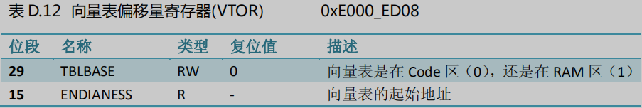
3. 如下表，1-15号用于系统异常，16号以上用于外部中断。

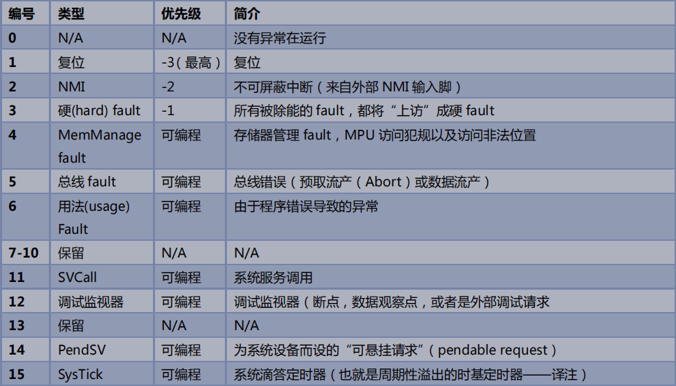

#### 可嵌套中断支持

​	前面了解到，中断嵌套与优先级密闭不可分。

​	如上表优先级一列，在M3中优先级的数值越小，优先级越高。其中，复位，NMI和硬件fault的优先级是固定，且高于其他中断。

​	理论上，M3支持3个固定最高优先级+256级可编程优先级，同时支持128级抢占。M3毕竟是由于嵌入式系统，芯片厂家在实现时都会进行精简，比理论值要小。因此，请忘记上面的数字，以芯片实际情况为准。

​	如下图，M3为了管理优先级，

 	1. 通过寄存器AIRCR为优先级分组，通过分组我们可以知道哪些bit代表抢占优先级，哪些bit代表亚优先级，如图中1->2->4。
 	2. 中断优先级寄存器阵列的每个寄存器都是8位的，映射到优先级分组后，如图中3->4，经过此映射，M3就知道每个中断的抢占优先级和亚优先级分别是多少了。
 	3. 当多个中断同时发生时，M3首先选择抢占优先级最高的中断执行，当抢占优先级相同的中断同时触发时，M3优先选亚优先级最高的执行。
 	4. 到此，我们也明白了为什么理论上优先级有256级，抢占优先级只有128个了。

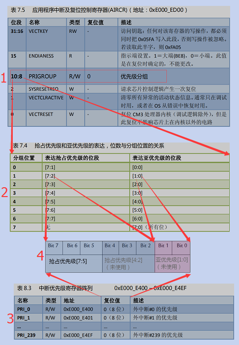	

#### 动态优先级调整支持

​	可以在程序运行过程中更改某中断的优先级。

#### 中断可屏蔽

​	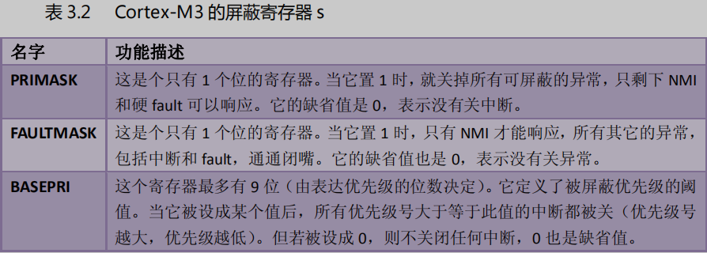

#### 中断延迟大大缩短

 	1. 向量化的设计，省去软件判断中断来源。
 	2. M3自动压栈和出栈R0-R3,R12,LR，PSR，PC寄存器，注意R4-R11需要手工入栈。
 	3. 优先级的有效合理分配，可以使需要的中断立马及时响应。
 	4. 咬尾中断和晚到中断机制，保证高优先级中断的实时响应。
 	5. 永不屏蔽的NMI（不可屏蔽中断），可以使系统第一时间做出响应，除非CPU挂了。

中断

**注释：**

​	如果理解了入栈、出栈流程和优先级，那么咬尾中断和晚到中断机制就好理解了。

​	咬尾中断：出栈时的优化，不出栈直接运行更高优先级中断，高优先级处理完毕后，一次一起出栈，省掉一次出栈过程。

​	晚到中断机制：入栈时的优化，入栈初期，更高优先级中断产生，先入栈更高优先级，提高高优先响应速度。

### 代码配置

​	下面代码和上面的描述一一对应，不难理解。

```c
static VOID UART1_NvicConfiguration(VOID)
{
    NVIC_InitPara NVIC_InitStructure;
    
    NVIC_InitStructure.NVIC_IRQ = USART1_IRQn; /* 要配置的中断号 */
    NVIC_InitStructure.NVIC_IRQPreemptPriority = 0; /* 抢占优先级 */
    NVIC_InitStructure.NVIC_IRQSubPriority = 0;  /* 亚优先级 */
    NVIC_InitStructure.NVIC_IRQEnable = ENABLE;  /* 使能控制 */
    NVIC_Init(&NVIC_InitStructure);
}
```


## 实战8__DMA

### 引子

​	在前面的串口例子中，我们可以看如果要通过串口发送一个字符串，需要CPU把每个字符一个一个的发送出去，整个数据传输的过程都需要CPU的参与。可以想象如果传输的数据量较大，那么CPU大部分时间都忙于数据的传输了，然而，我们希望CPU能去做其他更重要的事情，那么数据的传输有没有更好的办法呢？

​	有，就是DMA（直接存储器访问）一个可以实现数据在存储器和外设或存储器和存储器之间直接传输，而不需要CPU参与的功能，通称DMA控制器。

​	因此，如果我们设计一个DMA，可以这么做。假设CPU大哥有批货（数据）需要从杭州运到上海，那么可以招一个快递员（DMA小弟），告诉他收货地址、发货地址、货物大小和紧急程度，如果有多批货需要运到不同的城市，那就多招几个快递员，并成立一个快递公司管理。

​	上面的例子中，快递公司可以看做是DMA控制器，DMA通道可以看做是快递员，收货地址是数据目的地址，发货地址是数据源地址，货物大小是数据长度，紧急程度是软件优先级，快递员编号是硬件优先级。

### GD32的DMA管理

​	DMA不是Cortex-M3的内核的一部分，都是厂家自己设计的。如图，GD32 MDA1支持7通道，并和CPU共用系统总线，因此，和CPU是存在竞争关系的，只是总线仲裁比较偏心CPU，保证CPU至少有一半的总线带宽。

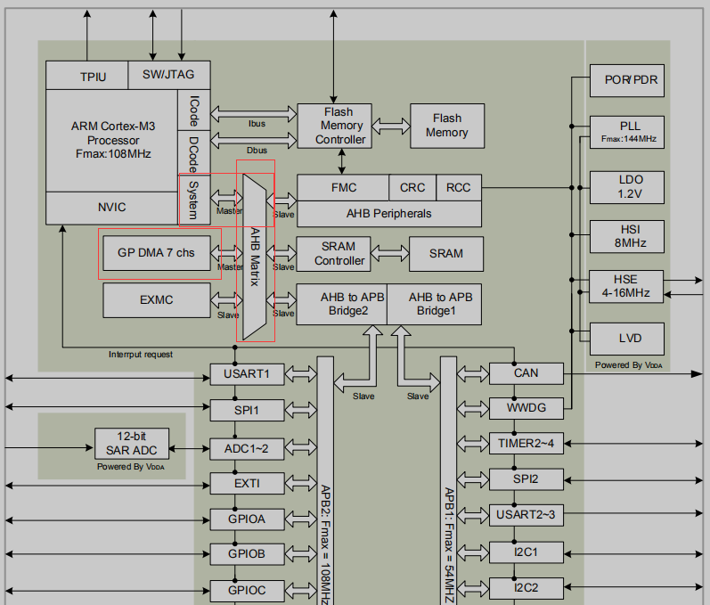

DMA的配置步骤：

 	1. 配置外设地址
 	2. 配置存储器地址
 	3. 配置传输数据总数
 	4. 配置软件优先级，传输方向，模式类型，数据尺寸和中断类型
 	5. 使能DMA

这些配置中，大部分在引子里已经说明了，理解不难，重点说下，优先级、模式类型和中断类型

优先级：

1. 优先级分两个层次，软件优先级和硬件优先级。软件优先级高于硬件优先级。

 	2. 软件优先级又分4个等级
 	3. 硬件优先级是固定的，就是通道号，如下图，通道编号越小，优先级越高。	

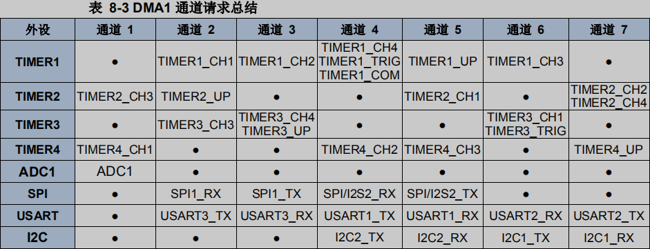

模式类型：

​	循环模式和普通模式

中断类型：

​	每个通道都有专门的中断，中断事件只有三个：传输完成，传输完成一半和传输错误。如下图，

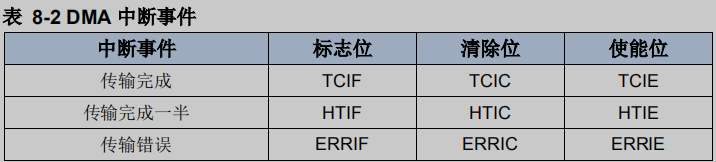

### 代码配置

```c
static VOID UART1_DmaRxConfig(IN U8 *buf, IN U32 len)
{
    DMA_InitPara DMA_InitStructure;
    
    DMA_Enable(DMA1_CHANNEL5, DISABLE);
    
    /* USART1 RX DMA1 Channel (triggered by USART1 Rx event) Config */
    DMA_DeInit(DMA1_CHANNEL5);
    DMA_InitStructure.DMA_PeripheralBaseAddr = (U32) &(USART1->DR);
    DMA_InitStructure.DMA_MemoryBaseAddr = (U32)buf;
    DMA_InitStructure.DMA_DIR = DMA_DIR_PERIPHERALSRC;
    DMA_InitStructure.DMA_BufferSize = len;
    DMA_InitStructure.DMA_PeripheralInc = DMA_PERIPHERALINC_DISABLE;
    DMA_InitStructure.DMA_MemoryInc = DMA_MEMORYINC_ENABLE;
    DMA_InitStructure.DMA_PeripheralDataSize = DMA_PERIPHERALDATASIZE_BYTE;
    DMA_InitStructure.DMA_MemoryDataSize = DMA_MEMORYDATASIZE_BYTE;
    DMA_InitStructure.DMA_Mode = DMA_MODE_NORMAL;
    DMA_InitStructure.DMA_Priority = DMA_PRIORITY_VERYHIGH;
    DMA_InitStructure.DMA_MTOM = DMA_MEMTOMEM_DISABLE;
    DMA_Init(DMA1_CHANNEL5, &DMA_InitStructure);
    DMA_Enable(DMA1_CHANNEL5, ENABLE);
}
```

## 实战9__ADC

### 原理

​	我们知道自然界中很多量都是模拟量，而CPU只能识别数字量，为此，我们按一定的时间间隔对模拟量进行采样，并把采集到的值转换成数字量。

​	一般情况，ADC都要经过采样，保持，量化，编码四个过程。

#### 如何实现

首先，我们看下如何实现一个简单的ADC，如下图，

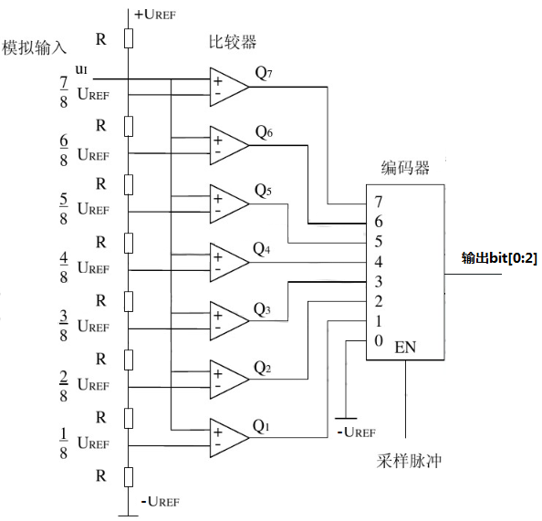

模拟信号从UI输入后，通过比较器与UREF（假设是+UREF=3.2V，-UREF=0V）进行比较，每当采样脉冲到来时，就完成一次转化，转化结果如下表，参考下表，CPU只要读取编码器输出值，就可以知道模拟输入UI的电压值了。

| 模拟输入UI          | 比较器输出（Q7-Q1） | 编码器输出(3bit) | 对应电压（+UREF=3.2V，-UREF=0） |
| ------------------- | ------------------- | ---------------- | ------------------------------- |
| UI<1/8UREF          | 0000000             | 0x0              | 0                               |
| 1/8UREF<=UI<2/8UREF | 0000001             | 0x1              | 0.4                             |
| 2/8UREF<=UI<3/8UREF | 0000011             | 0x2              | 0.8                             |
| 3/8UREF<=UI<4/8UREF | 0000111             | 0x3              | 1.2                             |
| 4/8UREF<=UI<5/8UREF | 0001111             | 0x4              | 1.6                             |
| 5/8UREF<=UI<6/8UREF | 0011111             | 0x5              | 2.4                             |
| 6/8UREF<=UI<7/8UREF | 0111111             | 0x6              | 2.8                             |
| UI>=7/8UREF         | 1111111             | 0x7              | 3.2                             |

#### 重要参数

ADC有下面几个重要参数必须掌握，可能不同芯片还会提供一些其他的功能参数，但是本质上都离不开下面几个参数。

1. 分辨率

   ​	如上例中，编码器输出只有3个bit，最多能分辨UREF/3bit=3.2/2^3=0.4V，那么这个ADC的分辨率就是3位的。可见，分辨率代表了ADC对模拟量的识别精度。

2. 转换时间

   ​	如上例中，假设比较器输出要1us，编码器输出3us，那么该ADC最快1+3=4us才能完成转换，这个就是转化时间。可见，转化时间代表了ADC的转化速度。至此，可以理解采样脉冲的时间间隔至少应该大于转换时间。

3. 输入范围

   ​	如上例中，输入的模拟信号是通过比较器跟参考电压进行比较才能完成采样和转换的，如果超出参考电压的范围，上述电路肯定无法正常工作，因此，输入范围是-UREF到+UREF。

### 使用举例

#### 硬件设计

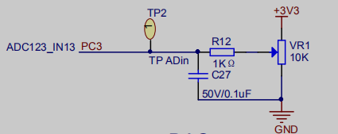

如图，我们采集可变电阻的电压值。

#### 软件设计

代码很简单，如下

```c
static VOID ADC_GpioConfig(VOID)
{
    GPIO_InitPara GPIO_InitStructure;
  
    GPIO_InitStructure.GPIO_Pin = GPIO_PIN_3;
    GPIO_InitStructure.GPIO_Speed = GPIO_SPEED_50MHZ;
    GPIO_InitStructure.GPIO_Mode = GPIO_MODE_AIN;
    GPIO_Init(GPIOC, &GPIO_InitStructure);
}

static VOID ADC_AdcConfig(VOID)
{
    ADC_InitPara ADC_InitStructure;
    
    ADC_InitStructure.ADC_Mode = ADC_MODE_INDEPENDENT;
    ADC_InitStructure.ADC_Mode_Scan = DISABLE;
    ADC_InitStructure.ADC_Mode_Continuous = ENABLE;
    ADC_InitStructure.ADC_Trig_External = ADC_EXTERNAL_TRIGGER_MODE_NONE;
    ADC_InitStructure.ADC_Data_Align = ADC_DATAALIGN_RIGHT;
    ADC_InitStructure.ADC_Channel_Number = 1 ;
    ADC_Init(ADC1, &ADC_InitStructure);
  
    ADC_RegularChannel_Config(ADC1, ADC_CHANNEL_13, 1, ADC_SAMPLETIME_71POINT5);
    ADC_Enable(ADC1, ENABLE);
    ADC_Calibration(ADC1);
    ADC_SoftwareStartConv_Enable(ADC1, ENABLE);
}

VOID DRV_ADC_Init(VOID)
{
    RCC_APB2PeriphClock_Enable(RCC_APB2PERIPH_GPIOC , ENABLE);
    RCC_APB2PeriphClock_Enable(RCC_APB2PERIPH_ADC1, ENABLE);
    RCC_ADCCLKConfig(RCC_ADCCLK_APB2_DIV12); 
    
    ADC_GpioConfig();
    ADC_AdcConfig();
}

U16 DRV_ADC_GetConversionValue(VOID)
{
    return ADC_GetConversionValue(ADC1);
}
```


## 实战10__I2C

### 知识点

1. 掌握I2C总线
2. 如何看时序图
3. 如何使用I2C接口的器件，例如AT24C02

### 原理

​	I2C/IIC（集成电路总线）是philips推出的一种串行总线。

#### 主要特性

1. 只有两根线，串行数据线SDA，串行时钟线SCL
2. 总线上的所有器件必须都有唯一的地址
3. 多主机总线，可同时支持多个slave和多个master，即支持冲突检测和仲裁
4. 8位双向数据传输，速率标准模式下最高100kbit/s，快速模式下最高400kbit/s，高速模式下最高3.4Mbit/s

#### 硬件电路要求

如图，

1. 由于设备之间是线与到一起的，所以设备的GPIO必须是开漏输出，不能是推挽输出
2. 由于GPIO是开漏输出，所以必须接上拉电阻，因此SDA和SCL默认是高电平

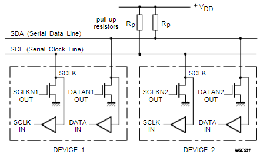

#### 协议要求

可以这么理解，

1. I2C上的设备要进行通信，必然需要收发两方，即发送器和接收器，
2. 总线需要初始化，需要有设备产生时钟信号，总线上的设备总要知道是谁正在访问谁，即主机和从机，主机完成总线初始化，产生时钟信号，并向从机发起寻址访问
3. 既然各方角色已经明确了，那么
   1. 当主机要访问从机时，总要告诉从机要开始了，即起始调节
   2. 当从机收到后，
      1. 可以告诉主机自己收到了，让主机继续发生后面的数据，即应答信号
      2. 也可以告诉主机自己不想搭理主机了，让主机停止发生，即非应答信号
   3. 当主机判断需要停止该次传输时，应该告诉从机通信结束，即停止调节

具体解释如下：

##### 1. 数据格式

如图，

1. SDA上的数据每个字节必须是8位，且是按bit传输的，高位先传，低位后传
2. 前8个bit是数据bit位，最后一个bit是应答或非应答信号


​	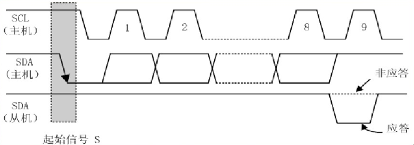

##### 2. 有效数据位识别

如图，

 	1. 当SCL为低电平时，SDA的状态是允许切换的，即发送的数据要在时钟是低电平时输出
 	2. 当SCL是高电平时，SDA的状态是不能变化的，即需要读取的数据要在时钟是高电平时读走

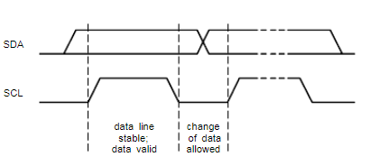

##### 3. 起始条件

​	如图，当SCL是高电平的时候，SDA由高电平变化到低电平

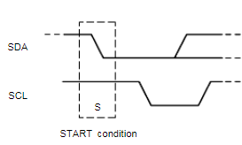


##### 4. 应答信号

如图，

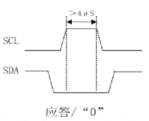

##### 5. 非应答信号

如图，

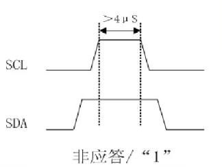

##### 6. 停止条件

​	如图，当SCL是高电平时，SDA由低电平变化到高电平

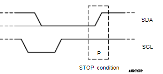

### 通过I2C总线读写EEPROM

#### 硬件设计

如图，我们通过I2C总线完成对EEPROM AT24C02的读写操作，A0,A1,A2都接地，即该芯片物理地址是0

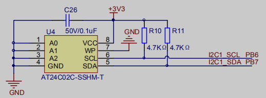


#### AT24C02C手册导读

要实现对AT24C02C读写操作，我们需要了解AT24C02C的基本功能和要求，这些可以从Datasheet中找到，例如

##### 1. 写保护和地址要求

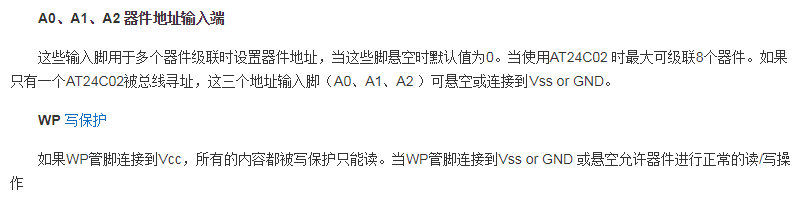

##### 2. 上电复位要求

如下图，芯片复位时长在130到270ms之间，稳妥起见，上电后至少应该在270ms后在对该芯片进行操作

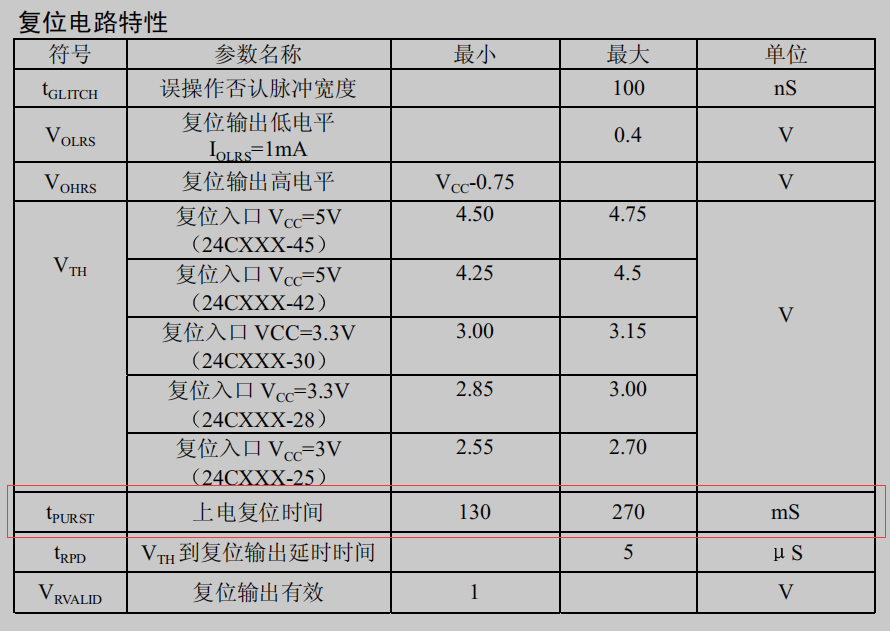

##### 3. I2C总线时序要求

如下图，SCL和SDA的每个电平的时间都做了详细的说明，编码时需要严格按照该时间要求编码。

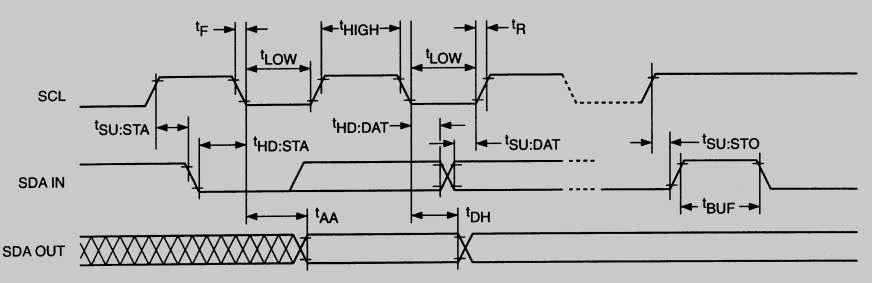

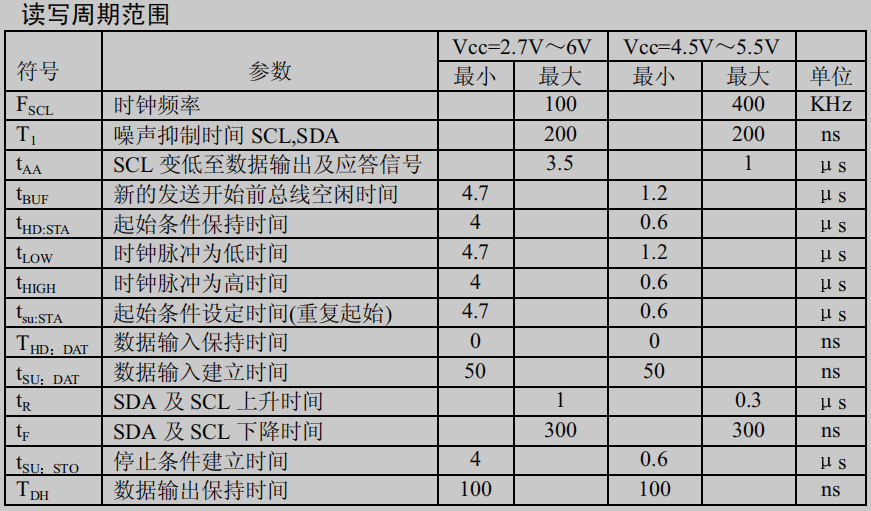

##### 4. 读操作的基本时序

1. 下面的图中，都只画了SDA的变化，没画SCL，原因是从I2C协议规定了SDA和SCL的关系，因此只要知道SDA怎么变化的自然就知道SCL应该如何变化，所以只画SDA足够了
2. 度操作支持下面三种，在手册里都有详细的介绍

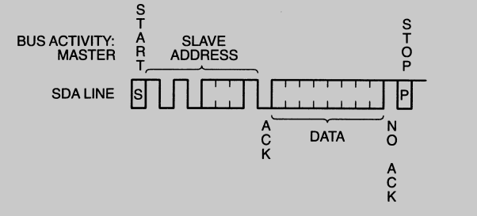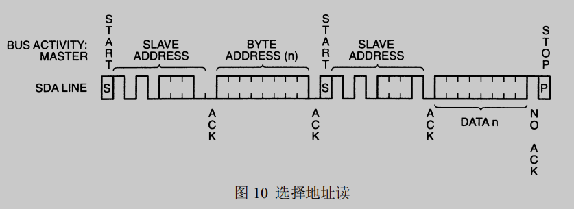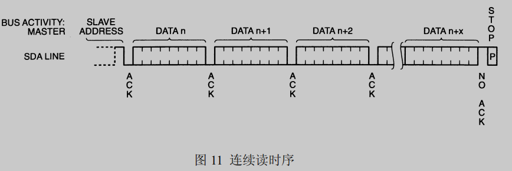


##### 5. 写操作的基本时序

写操作支持两种，手册里也有详细介绍

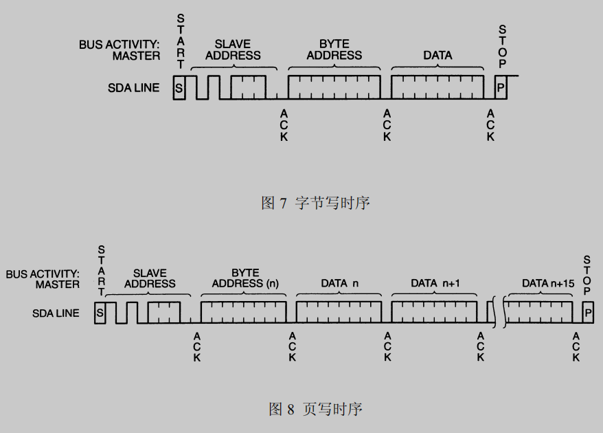

#### 软件设计

1. 为了更深入的理解I2C总线协议，此例中没用硬件I2C控制器，而是用GPIO口模拟的，原理明白了，硬件方式就更加简单了

2. 从前面的介绍可以看出，I2C总线是通用的，不仅AT24C02C可以使用，其它的芯片也可以使用，且协议规范是一样的，因此分成三部分，这样三部分的代码在后续的编码中可以做到通用
3. 下面三部分的编码与上面原理和手册中的时序是完全匹配的，可以对照阅读

##### 1. I2C总线驱动

1. 我把电平切换和延时封装成一个宏，这样函数中只要把精力都投入到电平变化就可以了
2. 延时时间固定5us，这样代码会简单很多，原因如“I2C总线时序要求”一节中，时序基本都要求了最小时间间隔5us足以，有两项有最大时间要求，却不影响我们编码。

```c
#define I2C_Set1(i2c) GPIO_SetBits(i2c);I2C_Delay(5);
#define I2C_Set0(i2c) GPIO_ResetBits(i2c);I2C_Delay(5);
#define I2C_Get(i2c) GPIO_ReadInputBit(i2c);

VOID DRV_I2C_Start(VOID)
{
    I2C_SetOutput(I2C_SDA);
    I2C_Set1(I2C_SDA);
    I2C_Set1(I2C_SCL);
    I2C_Set0(I2C_SDA);
    I2C_Set0(I2C_SCL);
}

VOID DRV_I2C_Stop(VOID)
{
    I2C_SetOutput(I2C_SDA);
    I2C_Set0(I2C_SDA);
    I2C_Set1(I2C_SCL);
    I2C_Set1(I2C_SDA);
}


U32 DRV_I2C_WriteByte(IN U8 data)
{
    U8 i = 0;
    U8 byte = data;
    U8 sda = 0;
    
    I2C_SetOutput(I2C_SDA);
        
    for (i = 0; i < 8; i++)
    {
        I2C_Set0(I2C_SCL);
        if (byte & 0x80)
        {
            I2C_Set1(I2C_SDA);
        }
        else
        {
            I2C_Set0(I2C_SDA);
        }
        I2C_Set1(I2C_SCL);
        byte <<= 1;
    }
    
    I2C_Set0(I2C_SCL);
    I2C_SetInput(I2C_SDA);
    I2C_Set1(I2C_SCL);

    sda = I2C_Get(I2C_SDA);
    if (sda)
    {
        I2C_Set0(I2C_SCL);
        I2C_SetOutput(I2C_SDA);
        return OS_ERROR;
    }
    
    I2C_Set0(I2C_SCL);
    I2C_SetOutput(I2C_SDA);
    I2C_Set1(I2C_SDA);
    
    return OS_OK;
}

U32 DRV_I2C_ReadByte(OUT U8 *byte)
{
    U8 i = 0;
    U8 bit = 0;
    U8 sda = 0;

    I2C_SetInput(I2C_SDA);
    
    for (i = 0; i < 8; i++)
    {
        I2C_Set1(I2C_SCL);
        sda = I2C_Get(I2C_SDA);
        if (sda)
        {
            bit |= 0x1;
        }
        I2C_Set0(I2C_SCL);
        if (i != 7)
        {
            bit <<= 1;
        }
    }
    *byte = bit;
    return OS_OK;
}

VOID DRV_I2C_NoAck(VOID)
{
    I2C_Set0(I2C_SCL);
    I2C_SetOutput(I2C_SDA);
    I2C_Set1(I2C_SDA);
    I2C_Set1(I2C_SCL);
    I2C_Set0(I2C_SCL);
}

VOID DRV_I2C_Ack(VOID)
{
    I2C_Set0(I2C_SCL);
    I2C_SetOutput(I2C_SDA);
    I2C_Set0(I2C_SDA);
    I2C_Set1(I2C_SCL);
    I2C_Set0(I2C_SCL);
}

VOID DRV_I2C_Init(VOID)
{
    GPIO_InitPara GPIO_InitStructure;

    RCC_APB2PeriphClock_Enable(RCC_APB2PERIPH_GPIOB,ENABLE);

    GPIO_InitStructure.GPIO_Pin =  GPIO_PIN_6 | GPIO_PIN_7;
    GPIO_InitStructure.GPIO_Mode = GPIO_MODE_OUT_OD;
    GPIO_InitStructure.GPIO_Speed = GPIO_SPEED_50MHZ;
    GPIO_Init(GPIOB, &GPIO_InitStructure);
    GPIO_SetBits(GPIOB, GPIO_PIN_6);
    GPIO_SetBits(GPIOB, GPIO_PIN_7);
}
```

##### 2. AT24C02C驱动

下面的函数接口与手册中的读写接口一一对应，其中立即地址读没有做，因为不常用。

```c
/* 字节写 */
VOID DRV_AT24C02C_WriteByte(IN U8 slaveAddr, IN U8 byteAddr, IN U8 data)
{
    DRV_I2C_Start();
    DRV_I2C_WriteByte(slaveAddr);
    DRV_I2C_WriteByte(byteAddr);
    DRV_I2C_WriteByte(data);
    DRV_I2C_Stop();
}

/* 页写 */
VOID DRV_AT24C02C_WritePage(IN U8 slaveAddr, IN U8 byteAddr, IN U8 data[], IN U8 len)
{
    U8 i = 0; 
    
    DRV_I2C_Start();
    DRV_I2C_WriteByte(slaveAddr);
    DRV_I2C_WriteByte(byteAddr);
    for (i = 0; i < len; i++)
    {
        DRV_I2C_WriteByte(data[i]);
    }
    DRV_I2C_Stop();
}

/* 选择地址读 */
VOID DRV_AT24C02C_ReadByte(IN U8 slaveAddr, IN U8 byteAddr, OUT U8 *data)
{
    U8 tmp = 0; 

    DRV_I2C_Start();
    DRV_I2C_WriteByte(slaveAddr);
    DRV_I2C_WriteByte(byteAddr);
    DRV_I2C_Start();
    DRV_I2C_WriteByte(slaveAddr+1);
    DRV_I2C_ReadByte(&tmp);
    DRV_I2C_NoAck();    
    DRV_I2C_Stop(); 
    *data = tmp;
}

/* 连续读 */
VOID DRV_AT24C02C_ReadPage(IN U8 slaveAddr, IN U8 byteAddr, OUT U8 data[], IN U8 len)
{
    U8 tmp = 0; 
    U8 i = 0;

    DRV_I2C_Start();
    DRV_I2C_WriteByte(slaveAddr);
    DRV_I2C_WriteByte(byteAddr);
    DRV_I2C_Start();
    DRV_I2C_WriteByte(slaveAddr+1);
    for (i = 0; i < len-1; i++)
    {
        DRV_I2C_ReadByte(&tmp);
        DRV_I2C_Ack();
        data[i] = tmp;
    }
    
    DRV_I2C_ReadByte(&tmp);
    DRV_I2C_NoAck();    
    data[i] = tmp;
    DRV_I2C_Stop();    
}

VOID DRV_AT24C02C_Init(VOID)
{
    DRV_I2C_Init();
}

```

##### 3. 功能测试举例

下面的代码，只是为了举例说明如何使用上述接口而已，其中0xA0的含义如下图，其中R/W位接口内部有处理，此处统一填了0。

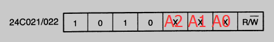

```c
#define I2C_AT24C02C_ADDR 0xA0

VOID APP_I2C_Test(VOID)
{
    U8 len = 255;
    U8 databufIn[5] = {0};
    U8 databufOut[255] = {0};
    U8 dataOut = 0;
    U8 byteAddr = 0x00;

    DRV_AT24C02C_Init();
    
    dataOut = 0;
    DRV_AT24C02C_ReadByte(I2C_AT24C02C_ADDR, byteAddr, &dataOut);
    APP_DEBUG("read=0x%x", dataOut);
    DRV_AT24C02C_WriteByte(I2C_AT24C02C_ADDR, byteAddr, 0x11);
    APP_Delay(10);
    DRV_AT24C02C_ReadByte(I2C_AT24C02C_ADDR, byteAddr, &dataOut);
    APP_DEBUG("read=0x%x", dataOut);
    
    DRV_AT24C02C_WriteByte(I2C_AT24C02C_ADDR, byteAddr, 0x2);
    APP_Delay(10);
    DRV_AT24C02C_ReadByte(I2C_AT24C02C_ADDR, byteAddr, &dataOut);
    APP_DEBUG("read=0x%x", dataOut);
    
    DRV_AT24C02C_WriteByte(I2C_AT24C02C_ADDR, byteAddr, 0xff);
    APP_Delay(10);
    DRV_AT24C02C_ReadByte(I2C_AT24C02C_ADDR, byteAddr, &dataOut);
    APP_DEBUG("read=0x%x", dataOut);

    DRV_AT24C02C_ReadPage(I2C_AT24C02C_ADDR, byteAddr, databufOut, len);
    I2C_Dump(databufOut, len);
    DRV_AT24C02C_WritePage(I2C_AT24C02C_ADDR, byteAddr, databufIn, 5);
    APP_Delay(10);
    DRV_AT24C02C_ReadPage(I2C_AT24C02C_ADDR, byteAddr, databufOut, len);
    I2C_Dump(databufOut, len);
    
    while(1);
}
```

## 实战11__SPI & FLASH

### 知识点

 	1. 理解SPI总线原理
 	2. 强化按时序图编程
 	3. 掌握FLASH

### SPI原理

1. SPI(Serial Peripheral Interface)串行外设接口，是Motorola公司推出的一种同步串行接口技术。具体高速、全双工、同步的特点。总线本身并没有提供流控、应答确认和校验机制，需要特别注意。

2. 如图，SPI是主从型总线有且只有一个主设备，可以有1个或多个从设备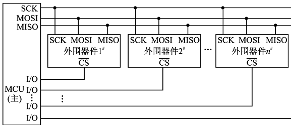

3. SPI至少需要4根线，分别是

   1. SCK  时钟信号，由主设备产生
   2. MOSI (Master Out Slave In） 主设备输出，从设备输入线
   3. MISO (Master In Slave Out） 主设备输入，从设备输出线
   4. CS（可以有多根）  片选信号线，用于控制跟哪个从设备通信

4. 如图，因SPI同步双工串行的特性，其内部原理非常简洁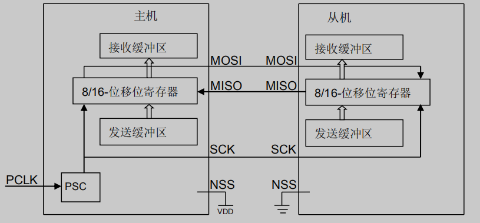

5. 从上面，可以理解SPI的收发其实就是在时钟信号下采样过程，那么我们是在时钟的上升沿、下降沿、高电平、低电平采样呢？SPI按时钟极性(CPOL)和时钟相位(CPHA)分成4种模式用于控制时钟采样，通信双方模式必须一致，具体如下

   1. | 模式  | CPOL | CPHA |
      | ----- | ---- | ---- |
      | Mode0 | 0    | 0    |
      | Mode1 | 0    | 1    |
      | Mode2 | 1    | 0    |
      | Mode3 | 1    | 1    |

   2. 时钟极性CPOL是用来配置SCLK的电平出于哪种状态时是空闲态或者有效态，时钟相位CPHA 
       是用来配置在第几个边沿采样数据。
       CPOL=0，表示当SCLK=0时处于空闲态，所以有效状态就是SCLK处于高电平时
       CPOL=1，表示当SCLK=1时处于空闲态，所以有效状态就是SCLK处于低电平时
       CPHA=0，表示数据采样是在第1个边沿，数据发送在第2个边沿
       CPHA=1，表示数据采样是在第2个边沿，数据发送在第1个边沿

   3. 主机和从机的发送数据是同时完成的，两者的接收数据也是同时完成的。所以为了保证主从机正确通信，应使得它们的SPI具有相同的时钟极性和时钟相位。

   4. SPI协议并没有规定数据一定是8位的，也可以是16位的，要看通信双方支持哪种。

   5. 传输时是高位先传还是低位先传，协议也没强制要求，也要看双方支持。

6. 至此，SPI协议部分已经全部介绍完了，可见SPI非常的简洁高效，且弹性很大，需要结合具体的应用配置。

### FLASH芯片手册导读

​	GD25Q40芯片是一款Nor FLash，Nor Flash的特点是以‘块’为操作的最小擦写单元，字节为最小读取单元。例如，该款芯片有512KByte=4094Kbit=4MBit，每页大小256Byte，每页就是Nand Flash的最下操作‘块’，具体如图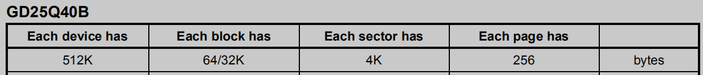

​	而且需要遵循先擦后写的操作。flash进行写操作时，只能将相应的位由1变0，而擦除才能把块内所有位由0变1。所有写入数据时，如果该页已经存在数据，必须先擦除再写。

​	既然Flash有如此特性，芯片是如何管理该芯片的呢？如下图，芯片通过一个命令和逻辑控制器与真正的存储空间进行交互，也可以这么理解，外部MCU要通过SPI总线，向FLASH芯片发送各式各样的命令来控制芯片的读写擦操作。

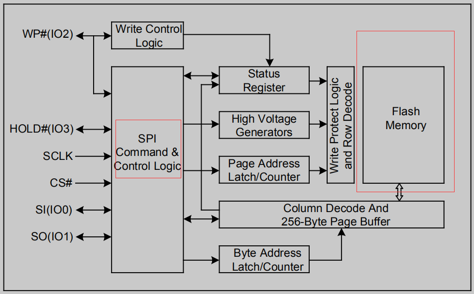

​	具体命令如下，命令很多，初看有点眼花，可以先看我标红的几个命令，可以看出，命令无非是写使能/去使能，读芯片状态，读数据，写数据，擦除命令。再仔细看其他命令也无法这几类，只是在不同模式的下操作罢了。注：此处提到的模式时芯片提供的，例如快速读写模式等等，有兴趣可阅读芯片手册，我选的是标准模式。

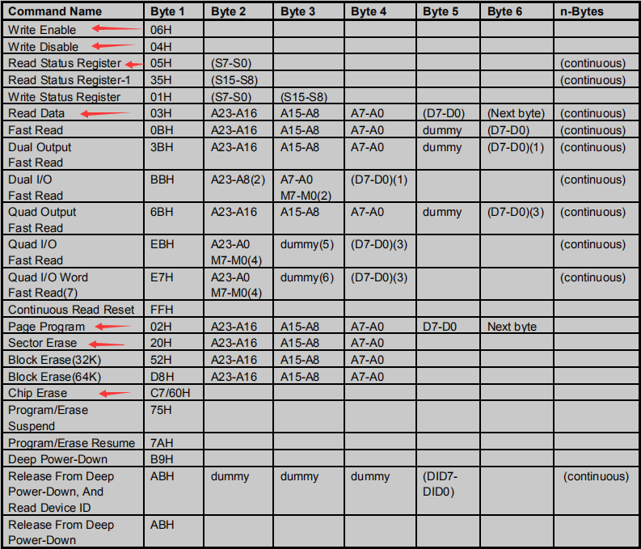

最后，只要安装命令的时序要求写成代码就可以了，具体时序在下面说。

### 通过SPI读写FLASH

​	用SPI总线读写FLASH芯片是非常常见的应用

#### 硬件设计

​	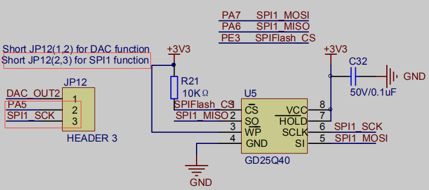

#### 软件设计

​	GD32是支持SPI控制器的，为了加深对SPI协议的理解，我会软件模拟一个SPI，也会用SPI控制器来实现一个，毕竟在实际应用中多少用硬件SPI控制器的。

##### 软件GPIO模拟SPI

​	从手册里可以查到，支持mode 0和3，此处我选mode 0，即CPOL和CPHA都为0。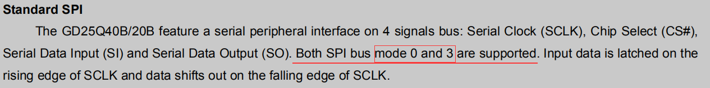

注意，时序参数要求必须按照手册描述写，如下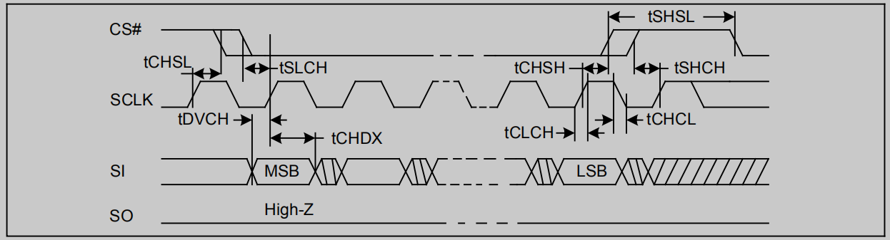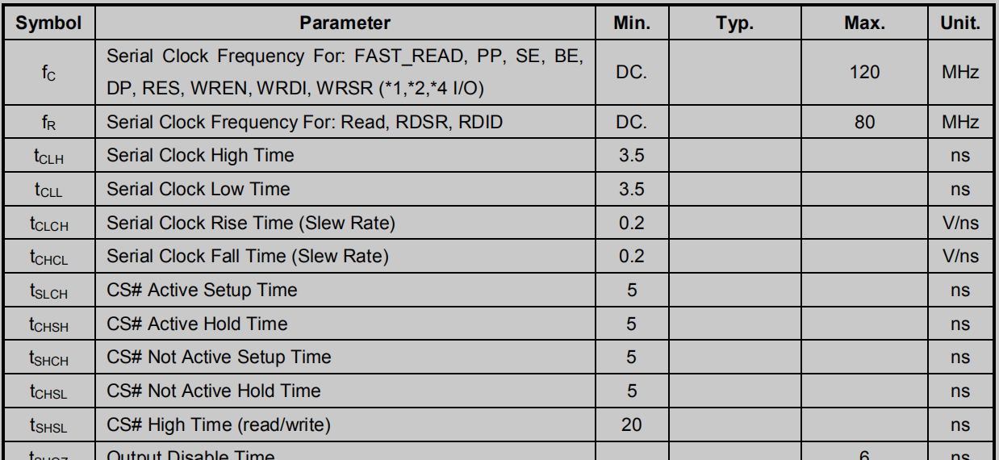

参考上表，我把延时时间固定5us，这样代码会简单很多，且满足了上述ns级最小延时的要求，虽然有几项有最大时间要求，却不影响我们编码。代码如下：

```c
U8 DRV_SPI_SwapByte(IN U8 byte)
{
    U8 i = 0;
    U8 inDate = byte;
    U8 outBit = 0;
    U8 outDate = 0;
    
    /* SCKPL = 0; SCKPH = 0 */
    for (i = 0; i < 8; i++)
    {
        if (inDate & 0x80)
        {
            SPI_MOSI_HIGH;
        }
        else
        {
            SPI_MOSI_LOW;
        }
        
        SPI_Delay(5);
        SPI_SCK_HIGH;
        outBit = SPI_MISO_READ;
        if (outBit)
        {
            outDate |= 0x1;
        }
        SPI_Delay(5);
        SPI_SCK_LOW;
        SPI_Delay(5);
        inDate <<= 1;
        if (i <7)
        {
            outDate <<= 1;
        }
    }

    return outDate;
}
```

##### 硬件SPI

​	详细阅读SPI配置部分代码，与前面原理部分说的完全一致，且参数GD32手册里也有详细说明。

```c
U8 DRV_SPI_SwapByte(IN U8 byte)
{
    while (SPI_I2S_GetBitState(SPI1, SPI_FLAG_TBE) == RESET);

    SPI_I2S_SendData(SPI1, byte);

    while (SPI_I2S_GetBitState(SPI1, SPI_FLAG_RBNE) == RESET);

    return SPI_I2S_ReceiveData(SPI1);
}

static VOID SPI_Configuration(VOID)
{
    SPI_InitPara  SPI_InitStructure;
    
    RCC_APB2PeriphClock_Enable(RCC_APB2PERIPH_SPI1, ENABLE);  
    
    SPI_InitStructure.SPI_TransType = SPI_TRANSTYPE_FULLDUPLEX;
    SPI_InitStructure.SPI_Mode = SPI_MODE_MASTER;
    SPI_InitStructure.SPI_FrameFormat = SPI_FRAMEFORMAT_8BIT;
    SPI_InitStructure.SPI_SCKPL = SPI_SCKPL_LOW;
    SPI_InitStructure.SPI_SCKPH = SPI_SCKPH_1EDGE;
    SPI_InitStructure.SPI_SWNSSEN = SPI_SWNSS_SOFT;
    SPI_InitStructure.SPI_PSC = SPI_PSC_32; 
    SPI_InitStructure.SPI_FirstBit = SPI_FIRSTBIT_MSB;
    SPI_InitStructure.SPI_CRCPOL = 7;
    SPI_Init(SPI1, &SPI_InitStructure);
    SPI_Enable(SPI1, ENABLE);      
}
```

##### FLASH芯片操作

1. 写使能，图中1,2,3步所示，代码也是按这个时序写的，下面的命令就不再画图说明了

   ```c
   static VOID GD25Q40_WriteEnable(VOID)
   {
       GD25Q40_CS_LOW();
       DRV_SPI_SwapByte(WREN);
       GD25Q40_CS_HIGH();
   }
   ```

2. 等待写操作结束，代码使用的是05H，所以只回一个字节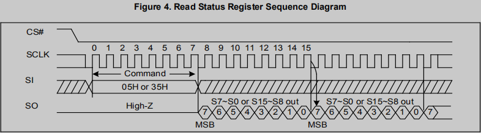

   ```c
   static VOID GD25Q40_WaitForWriteEnd(VOID)
   {
       U8 FLASH_Status = 0;
   
       GD25Q40_CS_LOW();
       DRV_SPI_SwapByte(RDSR);
   
       do
       {
           FLASH_Status = DRV_SPI_SwapByte(Dummy_Byte);
       }
       while ((FLASH_Status & WIP_Flag) == SET); /* Write in progress */
   
       GD25Q40_CS_HIGH();
   }
   ```

3. Sector擦除，擦除可以理解为一个特殊的写过程，即写FF的过程，所以在下一个操作之前需要等待写完成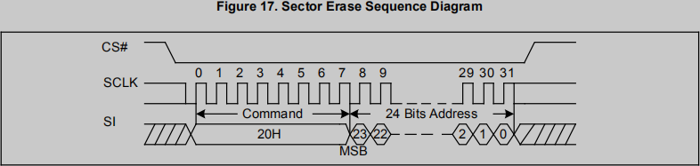

   ```c
   VOID DRV_GD25Q40_SectorErase(U32 SectorAddr)
   {
       GD25Q40_WriteEnable();
   
       GD25Q40_CS_LOW();
       DRV_SPI_SwapByte(SE);
       DRV_SPI_SwapByte((SectorAddr & 0xFF0000) >> 16);
       DRV_SPI_SwapByte((SectorAddr & 0xFF00) >> 8);
       DRV_SPI_SwapByte(SectorAddr & 0xFF);
       GD25Q40_CS_HIGH();
   
       GD25Q40_WaitForWriteEnd();
   }
   ```

4. Block擦除

   ```c
   VOID DRV_GD25Q40_BulkErase(VOID)
   {
       GD25Q40_WriteEnable();
   
       GD25Q40_CS_LOW();
       DRV_SPI_SwapByte(BE);
       GD25Q40_CS_HIGH();
   
       GD25Q40_WaitForWriteEnd();
   }
   ```

5. 读数据，读的时候可以指定任意地址读，且可以按字节读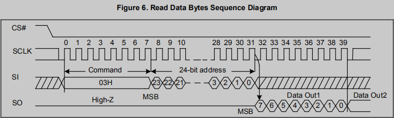

   ```c
   VOID DRV_GD25Q40_BufferRead(U8* pBuffer, U32 ReadAddr, U16 NumByteToRead)
   {
       GD25Q40_CS_LOW();
       DRV_SPI_SwapByte(READ);
       DRV_SPI_SwapByte((ReadAddr & 0xFF0000) >> 16);
       DRV_SPI_SwapByte((ReadAddr& 0xFF00) >> 8);
       DRV_SPI_SwapByte(ReadAddr & 0xFF);
       while (NumByteToRead--) 
       {
           *pBuffer = DRV_SPI_SwapByte(Dummy_Byte);
           pBuffer++;
       }
       GD25Q40_CS_HIGH();
   }
   ```

6. 按页写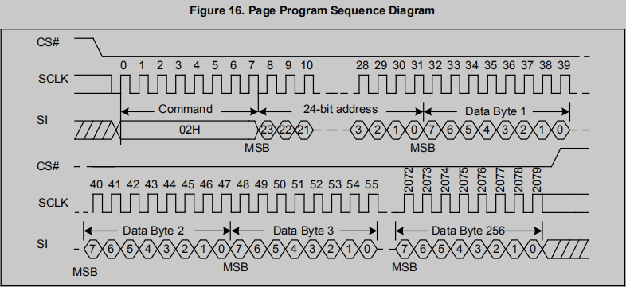

   ```c
   VOID DRV_GD25Q40_PageWrite(U8* pBuffer, U32 WriteAddr, U16 NumByteToWrite)
   {
       GD25Q40_WriteEnable();
   
       GD25Q40_CS_LOW();
       DRV_SPI_SwapByte(WRITE);
       DRV_SPI_SwapByte((WriteAddr & 0xFF0000) >> 16);
       DRV_SPI_SwapByte((WriteAddr & 0xFF00) >> 8);
       DRV_SPI_SwapByte(WriteAddr & 0xFF);
   
       while (NumByteToWrite--)
       {
           DRV_SPI_SwapByte(*pBuffer);
           pBuffer++;
       }
       GD25Q40_CS_HIGH();
   
       GD25Q40_WaitForWriteEnd();
   }
   ```

7. 写入一段buf，该接口是在按页的基础上，增加是否换页写的封装接口

   ```c
   VOID DRV_GD25Q40_BufferWrite(U8* pBuffer, U32 WriteAddr, U16 NumByteToWrite)
   {
       U8 NumOfPage = 0, NumOfSingle = 0, Addr = 0, count = 0, temp = 0;
   
       Addr = WriteAddr % GD25Q40_PageSize;
       count = GD25Q40_PageSize - Addr;
       NumOfPage =  NumByteToWrite / GD25Q40_PageSize;
       NumOfSingle = NumByteToWrite % GD25Q40_PageSize;
        /* WriteAddr is GD25Q40_PageSize aligned  */
       if (Addr == 0)
       {   
           /* NumByteToWrite < GD25Q40_PageSize */
           if (NumOfPage == 0) 
           {
               DRV_GD25Q40_PageWrite(pBuffer, WriteAddr, NumByteToWrite);
           }
           else /* NumByteToWrite > GD25Q40_PageSize */
           {
               while (NumOfPage--)
               {
                   DRV_GD25Q40_PageWrite(pBuffer, WriteAddr, GD25Q40_PageSize);
                   WriteAddr +=  GD25Q40_PageSize;
                   pBuffer += GD25Q40_PageSize;
               }
               DRV_GD25Q40_PageWrite(pBuffer, WriteAddr, NumOfSingle);
           }
       }
       else /* WriteAddr is not GD25Q40_PageSize aligned  */
       {
           if (NumOfPage == 0)
           {
               /* (NumByteToWrite + WriteAddr) > GD25Q40_PageSize */
               if (NumOfSingle > count) 
               {
                   temp = NumOfSingle - count;
                   DRV_GD25Q40_PageWrite(pBuffer, WriteAddr, count);
                   WriteAddr +=  count;
                   pBuffer += count;
                   DRV_GD25Q40_PageWrite(pBuffer, WriteAddr, temp);
               }
               else
               {
                   DRV_GD25Q40_PageWrite(pBuffer, WriteAddr, NumByteToWrite);
               }
           }
           else /* NumByteToWrite > GD25Q40_PageSize */
           {
               NumByteToWrite -= count;
               NumOfPage =  NumByteToWrite / GD25Q40_PageSize;
               NumOfSingle = NumByteToWrite % GD25Q40_PageSize;
   
               DRV_GD25Q40_PageWrite(pBuffer, WriteAddr, count);
               WriteAddr +=  count;
               pBuffer += count;
   
               while (NumOfPage--)
               {
                   DRV_GD25Q40_PageWrite(pBuffer, WriteAddr, GD25Q40_PageSize);
                   WriteAddr +=  GD25Q40_PageSize;
                   pBuffer += GD25Q40_PageSize;
               }
   
               if (NumOfSingle != 0)
               {
                   DRV_GD25Q40_PageWrite(pBuffer, WriteAddr, NumOfSingle);
               }
           }
       }
   }
   ```


##### 功能测试举例

```c
VOID APP_SPI_Test(VOID)
{
    U32 Manufact_ID = 0;
    U8  Tx_Buffer[256];
    U8  Rx_Buffer[256];
    U16 i = 0;
    
    DRV_GD25Q40_Init();
    
    printf("\n\rGD32103C-EVAL-V1.1 SPI Flash: configured...\n\r");
    Manufact_ID = DRV_GD25Q40_ReadID();
    printf("\n\rThe Flash_ID:0x%X\n\r", Manufact_ID);
  
    if (Manufact_ID == sFLASH_ID)   
    {
        printf("\n\rWrite to Tx_Buffer:\n\r");
        for(i=0; i<=255; i++)    
        {
            Tx_Buffer[i] = i;
            printf("0x%02X ",Tx_Buffer[i]);
            if(i%16 == 15)
            {
                printf("\n\r");
            }
        }
        printf("\n\rRead from Rx_Buffer:\n\r");
        DRV_GD25Q40_SectorErase(FLASH_WriteAddress);
        DRV_GD25Q40_BufferWrite(Tx_Buffer,FLASH_WriteAddress, 256);
        APP_Delay(10);
        DRV_GD25Q40_BufferRead(Rx_Buffer,FLASH_ReadAddress, 256);  
    
        for(i=0; i<=255; i++) 
        {	
            printf("0x%02X ", Rx_Buffer[i]);
            if(i%16 == 15)
            {
                printf("\n\r");
            }
        }
        printf("\n\rSPI Flash: Initialize Successfully!\n\r");
    }
    else
    {
        printf("\n\rSPI Flash: Initialize Fail!\n\r");
    }


}
```

### 补充，Nor Flash和Nand Flash

1. 结构方面
   1. Nor Flash采用内存的随机读取技术。各单元之间是并联的，对存储单元进行统一编址，所以可以随机访问任意一个字。既然是统一编址，Nor Flash就可以芯片内执行，即应用程序可直接在flash内运行，而无需先拷贝到RAM。
   2.  Nand Flash数据线和地址线共用I/O线，需额外联接一些控制的输入输出。
2. 读写速度方面
   1. Nor Flash有更快的读取速度
   2. Nand Flash有更快的写、擦除速度。
3. 寿命（耐用性）
   1. Flash写入和擦除数据时会导致介质的氧化降解。这方面Nor Flash尤甚，所以Nor Flash不适合频繁擦写。
   2. Nor的擦写次数是10万次，Nand的擦写次数是100万次。
4. 坏块处理
   1. Nand器件的坏块是随机分布的，在使用过程中，难免会产生坏块。所以在使用时要进行坏块管理以保障数据可靠。
5. 成本和容量
   1. 在面积和工艺相同的情况下，Nand的容量比Nor大的多，成本更低。
   2. Nor Flash可直接通过程序编程，根据地址直接读取，容量一般是M级别的
   3. Nand Flash是根据数据块来设计的，所有Nand Flash容量更大，一般是G级别的。
6. 易用性
   1. Nor Flash有专用的地址引脚来寻址，较容易和其他芯片联接，还支持本地执行。
   2. Nand Flash的IO端口采用复用的数据线和地址线，必须先通过寄存器串行地进行数据存取。各厂商对信号的定义不同，增加了应用的难度。
7. 编程角度
   1. Nor Flash采用统一编址（有独立地址线），可随机读取每个“字”，但NOR flash不能像RAM以字节改写数据，只能按“页”写，故Nor Flash不能代替RAM。擦除既可整页擦除，也可整块擦除。
   2. Nand Flash共用地址线和数据线，页是读写数据的最小单元，块是擦除数据的最小单元。
   3. 另外，Flash进行写操作时，只能将相应的位由1变0，而擦除才能把块内所有位由0变1。所有写入数据时，如果该页已经存在数据，必须先擦除再写。

## 实战12__定时器

与PWM章节共用代码

### 引子

​	生活中经常会用到下面几样，

1. 闹钟，到时间了给出提醒
2. 秒表（计时器），统计做一件事花费的时间

### 原理

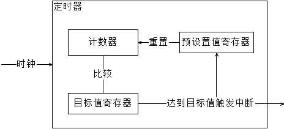

如上图，定时器需要一个时钟输入，在每个时钟触发时，做如下操作

 	1. 计数器做增加或减少的操作
 	2. 跟目标值做比较，达到目标则触发中断，并重新把预置值设置到计数器中

因此，实际配置中需要配置如下几步

1. 时钟源和分频系数等时钟参数
2. 预置值和目标值
3. 计数方式，增长和减少
4. 循环方式，单次还是循环触发

### 配置举例

#### 功能设计

​	使用定时器2，控制LED灯每隔1秒亮一次。

#### 定时器配置

 1. 配置分频，如图，定时器2的时钟来自AHB2(108M)--/2-->APB1(54M)--*2-->TIMER2(108M)，因此为了实现1s计时，此处配成108MHz/108100=10KHz，故Prescaler = 10800-1。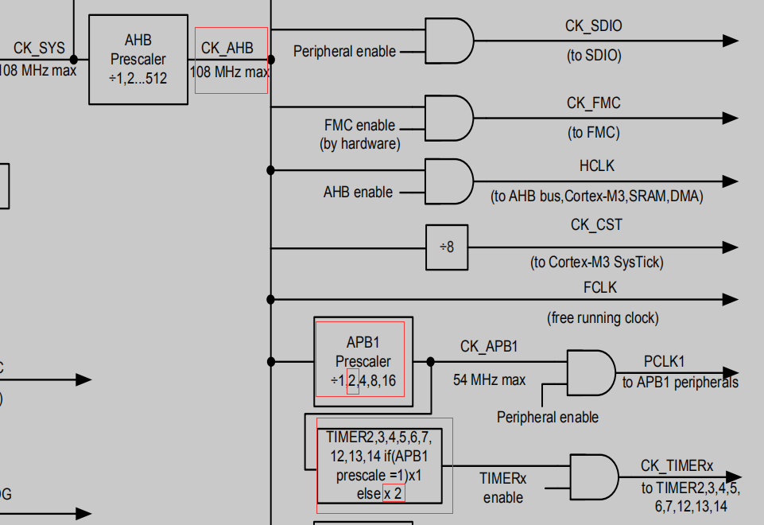

    ```c
    TIMER_BaseInitParaStructure.TIMER_Prescaler = 10800-1; /* 10KHz */
    ```

 2. 配置计数方式

    ```c
    TIMER_BaseInitParaStructure.TIMER_CounterMode = TIMER_COUNTER_UP;
    ```

 3. 配置预置值，第一步说把时钟配置成10KHz了，在10KHz的频率下，计数10000次，就是1s，故TIMER_Period = 10000-1

    ```c
    TIMER_BaseInitParaStructure.TIMER_Period = 10000-1; /* 10000*10KHz = 1s */
    ```

	4. 配置循环方式，默认就是循环计数模式，此步可以省下，如果是单步模式，则必须配置。

    ```
    TIMER_SinglePulseMode(TIMER2, TIMER_SP_MODE_REPETITIVE);
    ```

	5. 注意，定时器中断中，第一步必须先清除定时器中断标记，防止中断反复进入。

    ```c
    TIMER_ClearIntBitState(TIMER2,TIMER_INT_UPDATE);
    ```

	6. 完整代码如下，

```c
VOID TIMER2_IRQHandler(VOID)
{
    if(TIMER_GetIntBitState(TIMER2,TIMER_INT_UPDATE) != RESET)
    {   
        /* 定时器中断中，第一步必须先清除定时器中断标记，防止中断反复进入 */
        TIMER_ClearIntBitState(TIMER2,TIMER_INT_UPDATE);
        if (gTimerLedFlag != 0)
        {
            DRV_LED_On(DRV_LED1);
            gTimerLedFlag = 0;
            return;
        }
        DRV_LED_Off(DRV_LED1);
        gTimerLedFlag++;
    }
    
}

VOID DRV_TIMER_Timer2Init(VOID)
{
    TIMER_BaseInitPara TIMER_BaseInitParaStructure;
    NVIC_InitPara NVIC_InitStructure;

    RCC_APB1PeriphClock_Enable(RCC_APB1PERIPH_TIMER2,ENABLE); 
	
    TIMER_DeInit(TIMER2);
    TIMER_BaseInitParaStructure.TIMER_Prescaler = 10800-1; /* 10KHz */
    TIMER_BaseInitParaStructure.TIMER_CounterMode = TIMER_COUNTER_UP;
    TIMER_BaseInitParaStructure.TIMER_Period = 10000-1; /* 10000*10KHz = 1s */
    TIMER_BaseInitParaStructure.TIMER_ClockDivision = TIMER_CDIV_DIV1;
    TIMER_BaseInit(TIMER2,&TIMER_BaseInitParaStructure);

    TIMER_INTConfig(TIMER2, TIMER_INT_UPDATE, ENABLE);
    NVIC_InitStructure.NVIC_IRQ = TIMER2_IRQn;   
    NVIC_InitStructure.NVIC_IRQPreemptPriority = 0; 
    NVIC_InitStructure.NVIC_IRQSubPriority = 0;       
    NVIC_InitStructure.NVIC_IRQEnable = ENABLE;        
    NVIC_Init(&NVIC_InitStructure);
    
    TIMER_SinglePulseMode(TIMER2, TIMER_SP_MODE_REPETITIVE);
    TIMER_Enable(TIMER2,ENABLE);
}
```

## 实战13__PWM

与定时器章节共用代码

### 原理

​	PWM（Pulse Width Modulation脉宽调制）是利用微处理器的数字输出来对模拟电路进行控制的一种非常有效的技术。如下图，PWM输出的信号就是一串方波，PWM控制方波输出的频率和占空比（t1/t2）。

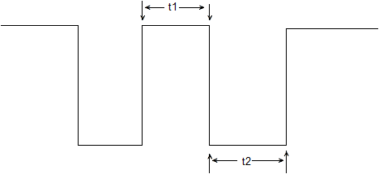

​	面积等效原理：冲量相等而形状不同的窄脉冲加在具有惯性的环节上时，其效果基本相同。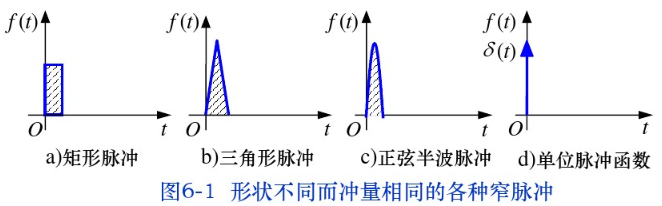

​	虽然PWM非常简单，但当其配合上面积等效原理后，作用就变的非常的大了。例如，利用PWM输出一个正玄半波。

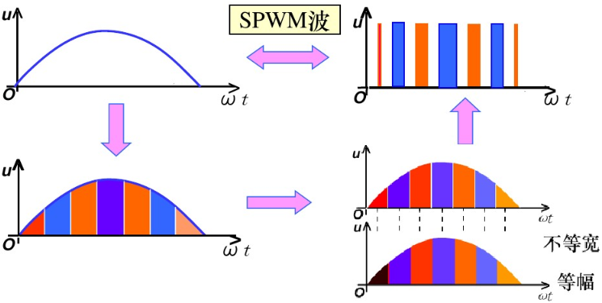

### 配置流程

​	由于PWM对时间的控制的高度依赖，因此GD32使用定时器来实现PWM，所以在配置时基本步骤是

1. 配置GPIO，TIMER2 通道3和串口Tx共用GPIOA，此处需要使能RCC_APB2PERIPH_AF

   ```c
       RCC_APB2PeriphClock_Enable( RCC_APB2PERIPH_GPIOA|RCC_APB2PERIPH_AF, ENABLE);
       
       GPIO_InitStructure.GPIO_Pin   = GPIO_PIN_2;
       GPIO_InitStructure.GPIO_Mode  = GPIO_MODE_AF_PP;
       GPIO_InitStructure.GPIO_Speed = GPIO_SPEED_50MHZ;
       GPIO_Init(GPIOA,&GPIO_InitStructure);
   ```

2. 配置定时器，配置PWM的频率为100Hz，周期10ms

   ```c
       TIMER_DeInit(TIMER2);
       TIMER_BaseInitParaStructure.TIMER_Prescaler = 108-1; /* 1MHz */
       TIMER_BaseInitParaStructure.TIMER_CounterMode = TIMER_COUNTER_UP;
       TIMER_BaseInitParaStructure.TIMER_Period = 10000-1; /* 10000*1MHz = 10ms */
       TIMER_BaseInitParaStructure.TIMER_ClockDivision = TIMER_CDIV_DIV1;
       TIMER_BaseInit(TIMER2,&TIMER_BaseInitParaStructure);
   ```

3. 配置PWM，配置占空比，脉冲宽度为5000*100Hz=5ms，即占空比5ms/10ms  = 50%

   ```c
       TIMER_OCInitStructure.TIMER_OCMode      = TIMER_OC_MODE_PWM1;
       TIMER_OCInitStructure.TIMER_OCPolarity  = TIMER_OC_POLARITY_HIGH;
       TIMER_OCInitStructure.TIMER_OutputState = TIMER_OUTPUT_STATE_ENABLE;
       TIMER_OCInitStructure.TIMER_OCIdleState = TIMER_OC_IDLE_STATE_RESET;
       TIMER_OCInitStructure.TIMER_Pulse = 4999; /* 5000*1MHz=5ms */
       TIMER_OC3_Init(TIMER2, &TIMER_OCInitStructure);
   ```

4. 完整代码如下

```c
VOID DRV_TIMER_Timer2PwmInit(VOID)
{
    GPIO_InitPara GPIO_InitStructure;
    TIMER_BaseInitPara TIMER_BaseInitParaStructure;
    TIMER_OCInitPara   TIMER_OCInitStructure;

    RCC_APB1PeriphClock_Enable(RCC_APB1PERIPH_TIMER2,ENABLE); 
    RCC_APB2PeriphClock_Enable( RCC_APB2PERIPH_GPIOA|RCC_APB2PERIPH_AF, ENABLE);
    
    GPIO_InitStructure.GPIO_Pin   = GPIO_PIN_2;
    GPIO_InitStructure.GPIO_Mode  = GPIO_MODE_AF_PP;
    GPIO_InitStructure.GPIO_Speed = GPIO_SPEED_50MHZ;
    GPIO_Init(GPIOA,&GPIO_InitStructure);
	
    TIMER_DeInit(TIMER2);
    TIMER_BaseInitParaStructure.TIMER_Prescaler = 108-1; /* 1MHz */
    TIMER_BaseInitParaStructure.TIMER_CounterMode = TIMER_COUNTER_UP;
    TIMER_BaseInitParaStructure.TIMER_Period = 10000-1; /* 10000*1MHz = 10ms */
    TIMER_BaseInitParaStructure.TIMER_ClockDivision = TIMER_CDIV_DIV1;
    TIMER_BaseInit(TIMER2,&TIMER_BaseInitParaStructure);
    
    TIMER_OCInitStructure.TIMER_OCMode      = TIMER_OC_MODE_PWM1;
    TIMER_OCInitStructure.TIMER_OCPolarity  = TIMER_OC_POLARITY_HIGH;
    TIMER_OCInitStructure.TIMER_OutputState = TIMER_OUTPUT_STATE_ENABLE;
    TIMER_OCInitStructure.TIMER_OCIdleState = TIMER_OC_IDLE_STATE_RESET;
    TIMER_OCInitStructure.TIMER_Pulse = 4999; /* 5000*1MHz=5ms */
    TIMER_OC3_Init(TIMER2, &TIMER_OCInitStructure);
    
    TIMER_Enable(TIMER2,ENABLE);
}
```

## 实战14__RTC

### 目的

​	虽然RTC简单，但是其牵扯的内容却蛮多的，例如时钟控制单元，电源控制，备份寄存器，最主要的目的还是想把下面3章引出来。

### 原理

​	RTC（Real_Time Clock）实时时钟，用于得到年、月、日、时、分、秒等时间日期信息。目前几乎已经是统一标准了，如图，32.768K经过15次分频后，恰好是1秒，其它时间只要在1秒频率下计数即可，RTC本质上就是一个1秒计数器。为了方便程序使用，内部会转化成年月日时分秒格式存储，并提供通信接口。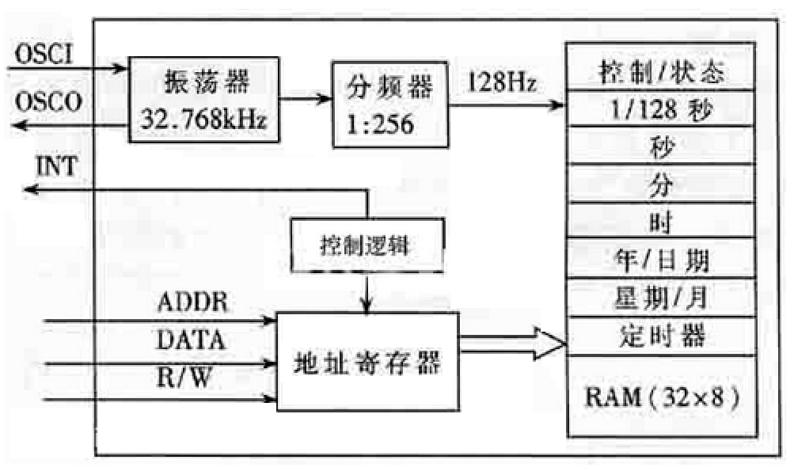

​	GD32内置RTC简化了上面的逻辑，直接使用一个32位计数器（2个16bit寄存器拼起来的）存储秒数，例如，1970年1月1号21点30分54秒=0x0+0x0+0x0+21x60x60+30×60+54=77454s，直接写入32位计数器中累加，只要读出该寄存器秒数，再反向运算也就知道日期时间了。

​	我们经常会遇到下面的需求，

1. 希望当MCU复位、异常重启时，时间不会丢
2. 希望MCU断电重启时，时间不会丢
3. 希望当到达某个时间后，唤醒MCU，其它时间MCU能处于低功耗状态

为此，

 	1. GD32将RTC分成两部分，把内核部分（预分频器、分频器、计数器、闹钟）放在备份域（后面章节会详解介绍），达到复位重启不丢时间的目的，其它（APB1接口）放在VDD电源域（电源控制章节详细介绍）跟随系统复位初始化，如下1图
 	2. 增加电池，当VDD断电后，自动切换到电池供电（VBAT），达到MCU断电不丢时间的目的，如下2图
 	3. 支持各种闹钟，各种中断，直接挂在NVIC上，用于中断响应、唤醒等功能

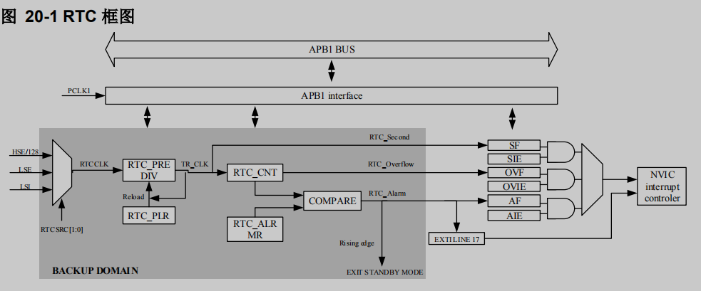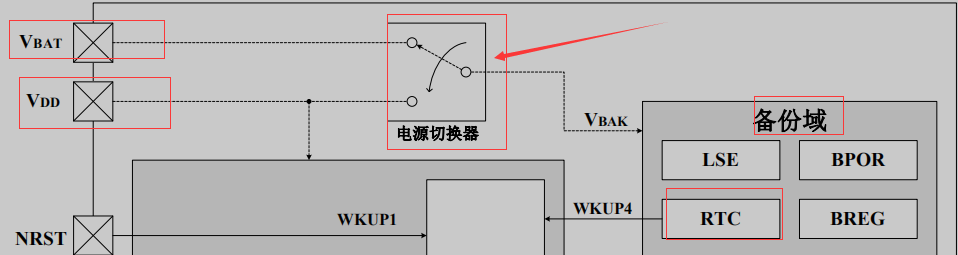

### 功能设计

实现一个时钟，具有如下功能

1. 每秒在串口输出当前时间，格式xxxx-xx-xx xx:xx:xx
2. 首次上电时，需要配置时间，串口输入
3. 复位，断电都不会丢失时间

代码如下：

1. 判断是否首次上电，此处用到了备份域的知识，详细参考下面备份域章节

   ```c
   /* TRUE 第一次启动 */
   BOOL DRV_POWER_IsFirstBoot(VOID)
   {
       if (POWER_FIRSTFLAG_VALUE != BKP_ReadBackupRegister(POWER_FIRSTFLAG_REG))
       {
           RCC_APB1PeriphClock_Enable(RCC_APB1PERIPH_PWR | RCC_APB1PERIPH_BKP, ENABLE);
           PWR_BackupAccess_Enable(ENABLE);
           BKP_DeInit();
           BKP_WriteBackupRegister(POWER_FIRSTFLAG_REG, POWER_FIRSTFLAG_VALUE);
           return TRUE;
       }
       else
       {
           return FALSE;
       }
   }
   ```

2. 首次上电，需要初始化RTC，就三步

   1. 选择时钟源，如图有三个选择，代码配置的是第二路，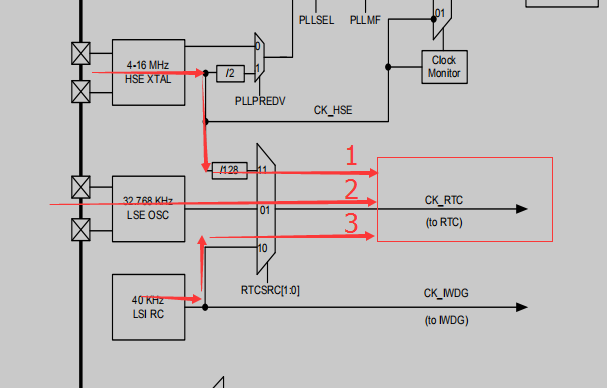

   2. 配置分频，最终得到1Hz的频率供RTC计数器使用

      ```c
      static RTC_FirstInit(VOID)
      {
          DRV_TRACE("First power on need to configure RTC.");
          
          /* 选择晶振LSE，低速外部晶振，即32.768Khz */
          RCC_RTCCLKConfig(RCC_RTCCLKSOURCE_LSE);
          RCC_LSEConfig(RCC_LSE_EN);
          while (RCC_GetBitState(RCC_FLAG_LSESTB) == RESET)
          {
          }
          RCC_RTCCLK_Enable(ENABLE);
          RTC_WaitRSF();
          RTC_WaitLWOFF();
      
          /* 分频，即1Hz */
          RTC_SetPrescaler(32768-1); /* 1s */
          RTC_WaitLWOFF();
      }
      ```

   3. 通过串口设置日期时间，并配置到RTC寄存器中

   ```c
   static time_t RTC_SetTime(VOID)
   {
       U32 year = 0xFF; 
       U32 mon = 0xFF; 
       U32 day = 0xFF;
       U32 hour = 0xFF; 
       U32 min = 0xFF; 
       U32 sec = 0xFF;
       struct tm t;
   
       memset(&t, 0, sizeof(t));
       printf("Please Set Time:\r\n");
       printf("Please input year:\r\n");
       scanf("%u", &year);
       printf("year:%u\r\n", year);
       
       printf("Please input mon:\r\n");
       scanf("%u", &mon);
       printf("mon:%u\r\n", mon);
       
       printf("Please input day:\r\n");
       scanf("%u", &day);
       printf("day:%u\r\n", day);
       
       printf("Please input hour:\r\n");
       scanf("%u", &hour);
       printf("hour:%u\r\n", hour);
       
       printf("Please input min:\r\n");
       scanf("%u", &min);
       printf("min:%u\r\n", min);
       
       printf("Please input sec:\r\n");
       scanf("%u", &sec);
       printf("sec:%u\r\n", sec);
       
       t.tm_sec = sec;
       t.tm_min = min;
       t.tm_hour = hour;
       t.tm_mday = day;
       t.tm_mon = mon-1; /* 0-11 */
       t.tm_year = year-1900; /* 从1900年开始开始计算的 */
   
       APP_DEBUG("%u-%u-%u %u:%u:%u", t.tm_year, t.tm_mon, t.tm_mday, t.tm_hour, t.tm_min, t.tm_sec);
       return(mktime(&t));
   }
   
   VOID DRV_RTC_TimeAdjust(IN U32 sec)
   {
       RTC_WaitLWOFF();
       RTC_SetCounter(sec);
       RTC_WaitLWOFF();
   }
   ```

3. 非首次上电，不需要重新配置RTC，只需要等待AHB接口时钟同步即可，因为RTC内核在备份域，AHB接口VDD供电，所以RTC内核配置不会断电，AHB接口需要同步

   ```c
   static VOID RTC_NotFristInit(VOID)
   {
       DRV_TRACE("Just need wait clock synchronized.");
       RTC_WaitRSF();
   }
   ```

4. 获取并显示时间

   ```c
   #define time DRV_RTC_GetTime
   time_t DRV_RTC_GetTime(time_t *timer)
   {
       U32 c = 0;
       c = RTC_GetCounter();
       if (timer != NULL)
       {
           *timer = c;
       }
   
       return c;
   }
   
   VOID APP_RTC_Test(VOID)
   {
       BOOL firstBootFlag = FALSE; 
       time_t now = 0;
   
       DRV_POWER_DumpBootReason();
       
       firstBootFlag = DRV_POWER_IsFirstBoot();
       DRV_RTC_Init(firstBootFlag);
       if (TRUE == firstBootFlag)
       {
           DRV_RTC_TimeAdjust(RTC_SetTime());
       }
       
       while(1)
       {
           APP_Delay(1000);
           now = time(NULL);
           printf("%s", ctime(&now));
       }
   }
   ```


## 实战15__时钟树

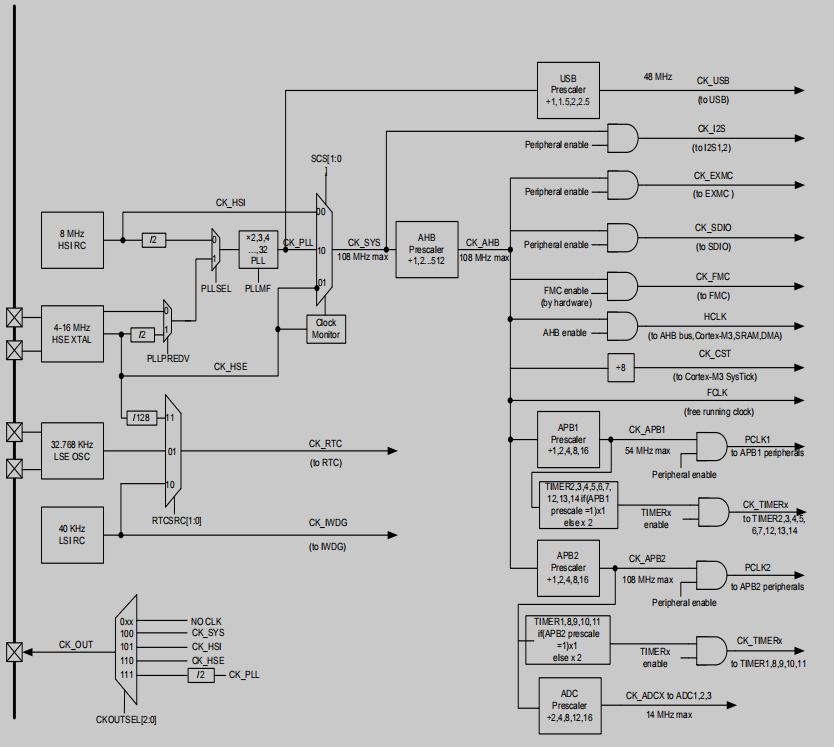

​	如上图，这就是时钟树，可以清晰的看到每个时钟分支是怎么走的，该如何配置，看该图时，可以遵循从右到左的顺序看，即先找到要配置的功能，然后在看该功能的时钟应该如何开启，例如RTC章节中的RTC时钟截图。

​	可以看出，系统的时钟源有4个，如下面截图，其中1和4是在芯片内部，2和3是在芯片外部的晶振。

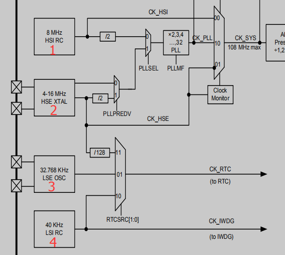

​	时钟源经过分频或倍频后，最终得到108MHz（图中1）提供给AHB使用，AHB下面分别挂APB1（图中2）和APB2（图中3），大部分的外设都挂在这两个桥，当然也用例外（图中4和5）

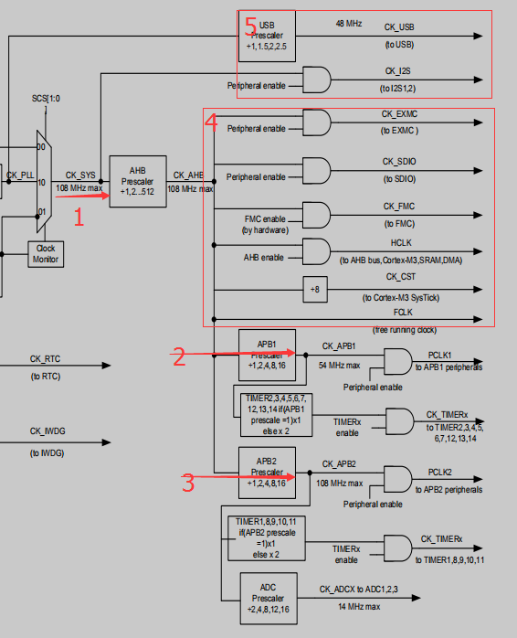


## 实战16__备份域

### 原理

​	备份域是只有一个目的，就是即使系统发生，该域也不会受影响，能够继续正常运行和保持数据不变。如图，为了达到该目的，备份域独立供电（图中1），独立时钟源（图中2），独立复位系统（图中3），独立的寄存器（图中4），还支持唤醒VDD域（图中5），同时提供APB通信接口（图中6）

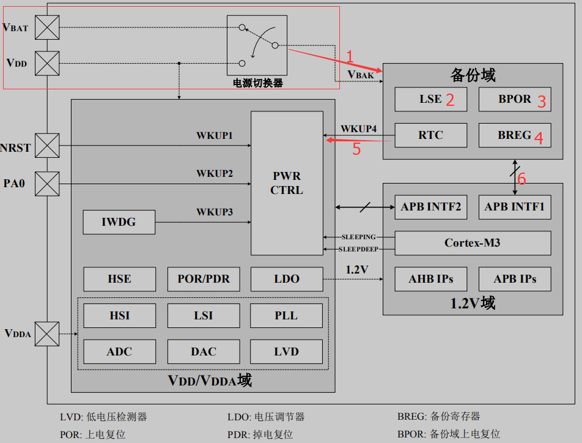

### 配置方法

​	其中，图中5会在下章（复位&电源控制&低功耗）说明，LSE、RTC和APB INTF1（图中6）的特性已经在RTC章节介绍过了，3、4是本章介绍的重点。

​	BREG（备份寄存器）共42个16位寄存器，可存储高达84个字节数据，从待机模式唤醒或系统复位都不会对这些寄存器造成影响。

​	在复位之后，任何对备份寄存器的写操作都是禁止的，即备份寄存器和RTC不允许访问，使能备份寄存器和RTC的写操作步骤如下：

 1. 首先通过设置RCC_APB1CCR寄存器的PWREN和BKPEN位来打开电源和备份接口时钟

 2. 然后再通过设置PWR_CTLR寄存器的BKPWE位来使能写权限，代码如下

    ```c
    RCC_APB1PeriphClock_Enable(RCC_APB1PERIPH_PWR | RCC_APB1PERIPH_BKP, ENABLE);
    PWR_BackupAccess_Enable(ENABLE);
    ```

寄存器读写接口如下

```c
BKP_ReadBackupRegister(BKP_DR1);
BKP_WriteBackupRegister(BKP_DR1, 0xA5A5)；
```

复位接口如下

```c
void BKP_DeInit(void)
{
    RCC_BackupReset_Enable(ENABLE);
    RCC_BackupReset_Enable(DISABLE);
}
```

总结，以上代码在RTC章节都已经用过了，可以仔细阅读。

### 测试方法

​	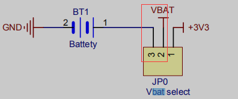

1. 使用RTC的例子代码。
2. 将上图中2、3脚接到一起，并安装电池，此步目的是为备份域提供备用电源（即电池供电）。
3. 将开发板断电，等一段时间后，例如10s，再重新上电，会发现RTC没有重新初始化，且时间也正常运行。说明BKP_DR1寄存器没有被清除，且RTC的内核也在正常工作。
4. 扣掉电池则不行。

## 实战17__复位&电源控制

### 复位

GD32的复位控制包括三种，电源复位、系统复位、备份域复位。

1. 电源复位
   1. 通常将电源复位称作冷复位
   2. 备份域除外的所有系统复位
   3. 触发方式
      1. 上电或掉电
      2. 从待机模式中返回后由内部复位发生器触发
   4. 复位地址固定在0x0000_0004
2. 系统复位
   1. SW-DP控制器和备份域除外
   2. 复位处理器内核和外部IP部分
   3. 触发方式有，如图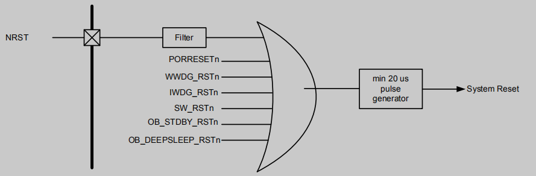
      1. 上电复位（PORRESETn）
      2. 外部硬件复位(NRST，Filter过滤干扰防止误复位)，硬复位
      3. 窗口看门狗复位(WWDG_RSTn)
      4. 独立看门狗复位(IWDG_RSTn)
      5. 中断应用和复位控制寄存器中复位bit被置位(SW_RSTn)，软复位
      6. 进入待机模式（OB_STDBY_RSTn）
      7. 进入深度睡眠模式（OB_DEEPSLEEP_RSTn）
   4. 复位脉冲发生器保证每一个复位源都能有至少20us的低电平脉冲延时，保证复位。
3. 备份域复位
   1. 只会复位备份域
   2. 触发方式
      1. 备份域控制寄存器BKPRST位置1
      2. 电源上电复位（VDD和VBAT二者都掉电，然后二者有一个上电）

### 电源控制

​	如下图，GD32包括三个电源域，即备份域、VDD/VDDA域和1.2V电源域。备份域已在前面介绍过了，下面重点说明VDD域和1.2V域

#### VDD/VDDA域

​	VDD/VDDA域又分成VDD和VDDA两部分，具体范围图中也已标出，虚线框主的HSI、LVD等等是VDDA供电，其它由VDD供电例如HSE等

##### POR/PDR

上电/掉电复位用于检测VDD电压低于特定阈值时产生复位信号，复位除备份域之外的整个芯片。如下表图，

 1. 上电时VDD电压从低到高上升，超过VPOR且超过VHYST时间后，触发POR。

 2. 当掉电时VDD电压从高到低下降，超过VPDR时，触发PDR。

 3. 从图中可以看出一般VPOR比VPDR电压高50mv。

    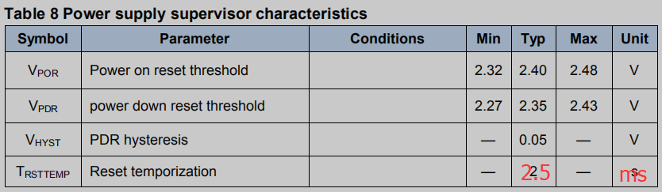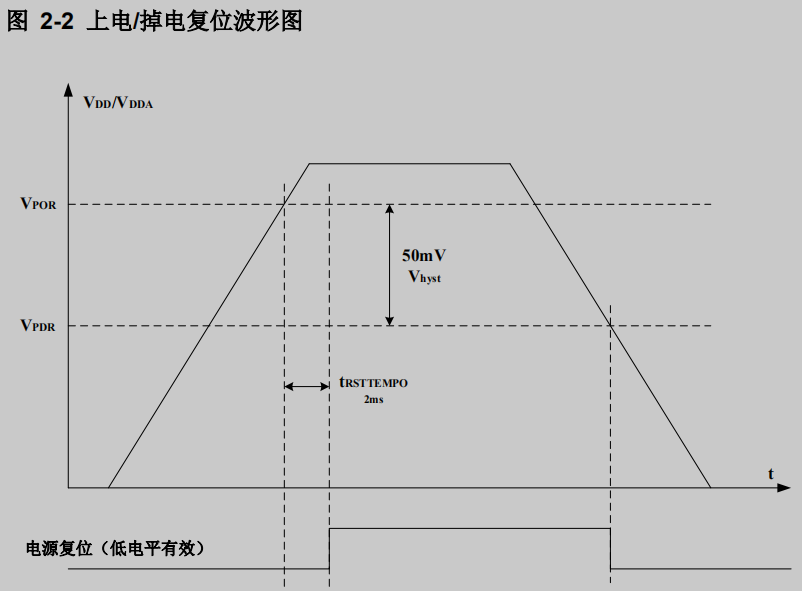

##### LDO

​	用于将VDD电压降到1.2V为1.2V域供电

##### LVD

​	用于检测VDDA供电电压是否低于某电压阈值，该阈值可以通过PWR_CTLR寄存器中的LVDT[2:0]位进行配置，也可以产生相应中断。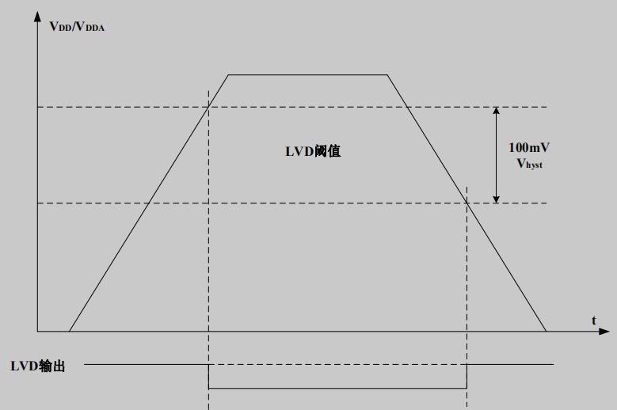

#### 1.2V电源域

​	该域主要为M3内核、AHB/APB外设及外设接口等供电。

## 实战18__低功耗

### 为什么需要低功耗

​	很多人都会陷入这样的误区，不用电池供电不需要低功耗。乍看之下似乎挺合理的，其实不然。低功耗并不是因为电源供电能力有限而做的不得已的选择，而是为了整个产品的长期稳定运作而做出的努力。

​	我认为，每个系统都应该考量低功耗的设计。

### 实现低功耗

​	本文只从芯片角度阐述低功耗，外围电路不做探讨。

​	我们知道芯片本质上就是一堆门电路，每个门的开关都会伴随电流产生功耗，因此降低功耗最好的办法就是停止这些门电路的运作。故要断其源头，即关闭时钟和关闭电源。例如GD32.

1. 我们可以是通过减缓系统时钟或者关闭未使用的外设或模块的时钟达到降低功耗的目的。
2. 也可以通过控制电源域供电，达到低功耗目的，为此GD32支持3种省电模式。即，睡眠模式、深度睡眠模式和待机模式，如下表，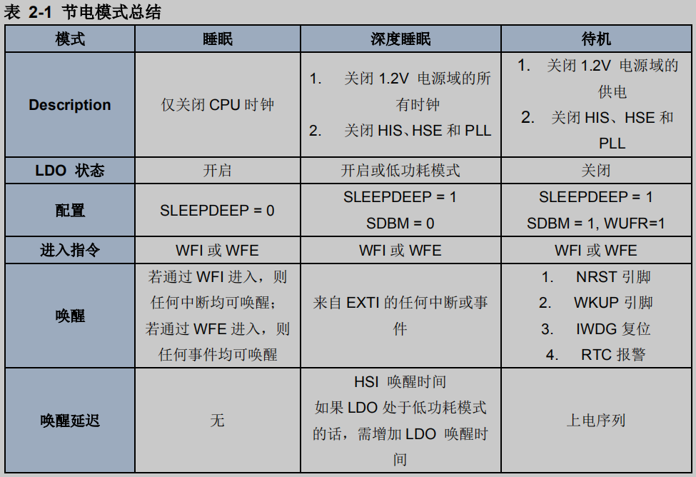
3. 各模式下的功耗，如下表，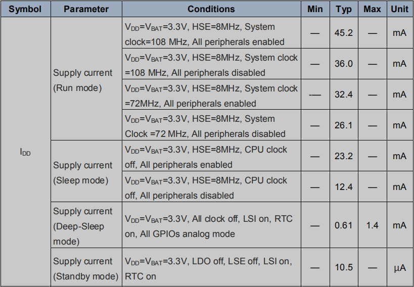

#### 睡眠模式

该模式同M3的SLEEPING模式对应，该模式下仅官方M3的时钟。

进入方法是，

1. 清除M3系统控制寄存器中的SLEEPDEEP位，执行WFI或WFE指令进入。

唤醒方法是，

1. WFI指令，任何中断都可以唤醒。
2. WFE指令，任何事件都可以唤醒。

进入机制是，根据M3的SCR（系统控制寄存器）的SLEEPONEXIT位，支持两种睡眠进入机制，

1. sleep-now：如果SLEEPONEXIT位被清零，一旦执行WFI或WFE指令，MCU立即进入睡眠模式。
2. sleep-on-exit：如果SLEEPONEXIT位被置位，当系统从最低优先级的中断处理程序离开后，MCU立即进入睡眠模式。

特点是，唤醒时间最短。

代码如下，

```c
void PWR_SLEEPMode_Entry(uint8_t PWR_SLEEPENTRY)
{
    /* Clear SLEEPDEEP bit of Cortex-M3 System Control Register */
    SCB->SCR &= ~((uint32_t)SCB_SCR_SLEEPDEEP_Msk);
    
    /* Select WFI or WFE to enter Sleep mode */
    if(PWR_SLEEPENTRY == PWR_SLEEPENTRY_WFI)
    {
        __WFI();
    }
    else
    {
        __WFE();
    }
}
```

#### 深度睡眠模式

该模式同M3的SLEEPDEEP模式对应，该模式下，1.2V域中所有时钟全部关闭，HSI，HSE、及PLL也全部被禁用。

进入方法是，

1. 将M3系统控制寄存器SLEEPDEEP位置1
2. 清除PWR_CTLR寄存器的SDBM位
3. 执行WFI或WFE指令立即进入

唤醒方法是，任何来自EXTI的中断或唤醒事件都可以唤醒。

特点及注意事项，

1. 刚退出深度睡眠模式时，会选HSI作为系统时钟。
2. 为了顺利进入深度睡眠模式，所有EXTI线上的挂起状态（在EXTI_PD寄存器中）和RTC闹钟标志必须复位，否则，无法进入深度睡眠模式。
3. LDO从低功耗模式唤醒，需要延时等待。
4. 保留寄存器和SRAM中的数据。

LDO低功耗，

1. 可以通过PWR_CTLR寄存器中的LDOLP位控制LDO工作在正常模式还是低功耗模式。
2. LDO从低功耗模式唤醒，需要延时等待。

```c
void PWR_DEEPSLEEPMode_Entry(uint32_t PWR_LDO, uint8_t PWR_DEEPSLEEPENTRY)
{ 
    uint32_t temp = 0;
    
    /* Select the LDO state in Deep-sleep mode */
    temp = PWR->CTLR;
    
    /* Clear SDBM and LDOLP bits, and select Deep-sleep mode */
    temp &= ~((uint32_t)(PWR_CTLR_SDBM | PWR_CTLR_LDOLP));
    
    /* Set LDOLP bit according to PWR_LDO value, and select the LDO's state */
    temp |= PWR_LDO;
    
    /* Store the new value */
    PWR->CTLR = temp;
    
    /* Set SLEEPDEEP bit of Cortex-M3 System Control Register */
    SCB->SCR |= SCB_SCR_SLEEPDEEP_Msk;
    
    /* Select WFI or WFE to enter Deep-sleep mode */
    if(PWR_DEEPSLEEPENTRY == PWR_DEEPSLEEPENTRY_WFI)
    {
        __WFI();
    }
    else
    {
        __SEV();
        __WFE();
        __WFE();
    }
    /* Reset SLEEPDEEP bit of Cortex-M3 System Control Register */
    SCB->SCR &= ~((uint32_t)SCB_SCR_SLEEPDEEP_Msk);
}
```


#### 待机模式

该模式可以看做是SLEEPDEEP模式的升级版，把1.2V域全部断电，LDO，HSI，HSE，PLL也断电。

进入方法是，

1. 将M3系统控制寄存器的SLEEPDEEP位置1,
2. PWR_CTLR寄存器的SDBM位置1，
3. 清除PWR_STR寄存器的WUF位，
4. 执行WFI或WFE指令立即进入。

检查方法是，可以通过PWR_STR寄存器中的SBF位状态判断MCU是否进入待机模式。

唤醒方法是，只有下面4种

1. NRST引脚的外部复位
2. RTC报警
3. IWDG复位
4. WKUP引脚上升沿

特点是，

1. 功耗最低，唤醒时间最长
2. SRAM和寄存器的内容丢失，备份寄存器除外
3. 退出待机模式时，会发生上电复位

```c
void PWR_STDBYMode_Entry(uint8_t PWR_STDBYENTRY)
{
    /* Set SLEEPDEEP bit of Cortex-M3 System Control Register */
    SCB->SCR |= SCB_SCR_SLEEPDEEP_Msk;

    /* Set SDBM bit, and select Standby mode */
    PWR->CTLR |= PWR_CTLR_SDBM;
        
    /* Reset Wakeup flag */
    PWR->CTLR |= PWR_CTLR_WUFR;
    
    /* Select WFI or WFE to enter Standby mode */
    if(PWR_STDBYENTRY == PWR_STDBYENTRY_WFI)
    {
        __WFI();
    }
    else
    {
        __WFE();
    }
}
```

## 实战19__看门狗

### 为什么需要看门狗

​	我们总是期望产品能够一直稳定运行从不宕机，但事实总是不尽人意，有各种预料不到的情况发生，宕机不可避免，退而求次，我们又希望万一发生宕机，系统能够自行检测并恢复。看门狗就是为了检测故障并恢复一种常见手段。

​	为什么叫看门狗呢？其实是一个很形象的称呼，就好像有只狗在看门一样，CPU需要固定时间喂一次食，不管CPU出于任何原因没有喂狗，狗就会叫，我们知道CPU肯定是出问题了。

​	看门狗通常有两类，

1. 外部看门狗，在MCU之外增加看门狗芯片，可以检查MCU硬件故障，并恢复。
2. 内部看门狗，利用MCU内部自带看门狗，无法检查MCU硬件故障，只能检查软件故障，并恢复。

### 如何配置

GD32内部自带独立看门狗和窗口看门狗。

1. 独立看门狗有独立时钟源，就算主时钟失效，它仍然能正常工作，非常适合需要独立环境而对计时精度要求不高的场景。
2. 窗口看门狗适用于需要精确计时的场景

本质上就是一个计数器，配置非常简单，直接上代码了

```c
#define DRV_IWDG_FeedWDog IWDG_ReloadCounter

VOID DRV_IWDG_Init(VOID)
{
    /* Enable write access to IWDG_PSR and IWDG_RLDR registers */
    IWDG_Write_Enable(IWDG_WRITEACCESS_ENABLE);

    /* IWDG counter clock: 40KHz(LSI) / 64 = 0.625 KHz */
    IWDG_SetPrescaler(IWDG_PRESCALER_16);

    /* Set counter reload value to 625 */
    IWDG_SetReloadValue(0x0fff);

    /* Reload IWDG counter */
    IWDG_ReloadCounter();

    /* Enable IWDG (the LSI oscillator will be enabled by hardware) */
    IWDG_Enable();
}
```

测试结果，如图，当没有喂狗时，系统会不断被狗咬，重启原因如图，喂狗后，系统正常。

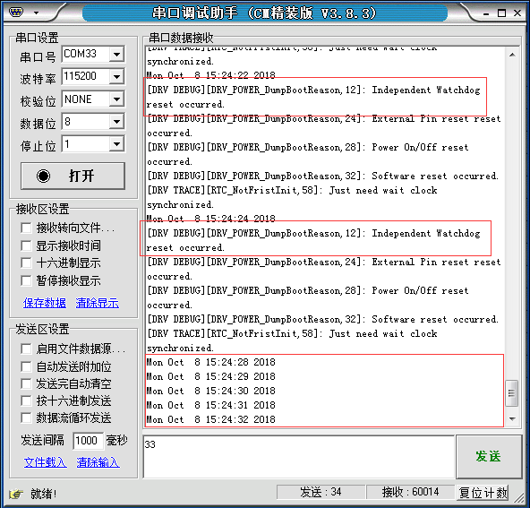


## 实战20__Boot综合实验

### 知识点

设计并实现一个boot，需要用到如下知识点，

#### 1. 体会boot的作用

#### 2. 新增闪存控制器学习

#### 3. 串口知识复习

#### 4. FLASH&SPI知识复习

#### 5. 状态机知识点复习

#### 6. 初识上位机软件

#### 7. xmodem通信协议学习

#### 8. 交互界面设计

### 设计细节

#### UI界面设计

##### 启动引导界面

```
**************************
  Press Ctrl+c into bootmenu.
. . . . . <-- 此处每秒打印一个点，打印完5个点后，进入APP，打印期间按下Ctrl+c进入boot主界面
```

##### 主界面

按相应的数字，进入相应的功能界面

```
**************************
  welcome to boot
**************************
0. help
1. reboot
2. get app by uart
3. update
4. update and reboot
5. dump app in flash
6. dump app in rom
```

##### 帮助界面

```
**************************
0. help
1. reboot
2. get app by uart
3. update
4. update and reboot
5. dump app in flash
6. dump app in rom
```

##### 重启界面

```
**************************
booting...
```

##### 获取APP文件界面

```
**************************
please wait a moment to get the app.
**************************
getting app,press q stop.

<---选择Transfer/Send Xmodem../选择文件/确定

Starting xmodem transfer.  Press Ctrl+C to cancel.
Transferring test.bin...
  100%       6 KB       6 KB/sec    00:00:01      50 Errors  

**************************
get app file sucess.
press 0 get help.
```

##### 升级界面

```
**************************
updating...
**************************
update ok, press 0 get help.
```

##### 升级并重启界面

```
**************************
updating...
**************************
update ok, press 0 get help.
**************************
booting...
```

##### 从Flash中dump文件界面

```
**************************
app dumpping from flash...

<---选择本地文件，Transfer/Recive Xmodem../选择文件/确定

Starting xmodem transfer.  Press Ctrl+C to cancel.
Transferring D:\aaa.bin...
         62 KB        6 KB/sec    00:00:10   0 Errors  
         
**************************
app dumpping ok, press 0 get help.
```

##### 从Rom中dump文件界面

```
**************************
app dumpping from rom...

<---选择本地文件，Transfer/Recive Xmodem../选择文件/确定

Starting xmodem transfer.  Press Ctrl+C to cancel.
Transferring D:\aaa.bin...
         62 KB        6 KB/sec    00:00:10   0 Errors  
         
**************************
app dumpping ok, press 0 get help.
```

#### 状态机设计

如下图，通过用户输入指令，分别进入不同功能，显示不同引导界面，并在该状态下完成相应子功能。

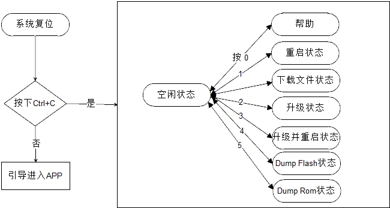

#### 各子功能设计

##### 引导进入APP功能设计（涉及CPU程序运行原理）

所谓引导至APP，其实就做两件事，一是重置MSP指针，二是重置PC指针。具体原因在OS章节有说明。

```c
typedef  void (*pAppFunction)(void);
#define BOOT_APP_MAIN_ADDR 0x800E000
static VOID BOOT_GoToApp(VOID)
{
    pAppFunction Jump_To_Application;
    unsigned long jumpAddress;
    
    //跳转至用户代码
    jumpAddress = *(volatile U32*)(BOOT_APP_MAIN_ADDR + 4);
    Jump_To_Application = (pAppFunction)jumpAddress;
    
    //初始化用户程序的堆栈指针
    __set_MSP(*(volatile U32*) BOOT_APP_MAIN_ADDR);
    Jump_To_Application();
}
```

##### 重启功能设计（涉及看门狗）

```c
DRV_IWDG_Init(); /* 利用看门狗复位芯片 */
```

##### 文件传输功能设计（涉及XMODEM协议）

文件传输采用Xmodem协议，该协议非常简单，如下，

报文格式：

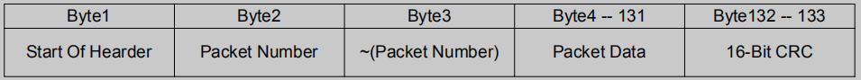

1. 串口配置为异步，8位数据，no校验，no停止位
2. 报文格式说明
   1. Byte1，Start Of Hearder， 如下，
      1. SOH(01H) -- Xmodem数据头
      2. EOT(04H) -- 发送结束 
      3. ACK(06H) -- 认可响应
      4. NAK(15H) -- 不认可响应
      5. CAN(18H) -- 撤销传送
   2. Byte2，Packet Number ，报文序列码，从1开始，每包递加，FF后循环
   3. Byte3，~(Packet Number)，报文序列码的补码
   4. Byte4-131，Packet Data，报文数据，每个报文都是128个字节，如果不足128，则用1AH补充
   5. Byte132-133,16bit CRC，Byte132-CRC高位，Byte133-CRC地位，只对128个数据做CRC16运行，多项式为X^16+X^12+X^5+1。
3. 交互流程
   1. Tx方发生SOH数据报文
   2. Rx方收到且数正确，回ACK，不正确会NAK
   3. 文件传输完毕，Tx发EOT通知Rx，Rx回ACK
   4. 任何时候，收到CAN，则强制停止
4. 代码如下，

```c
#define XMODEM_SOH  0x01  /* Xmodem数据头 */
#define XMODEM_STX  0x02  /* 1K-Xmodem数据头 */
#define XMODEM_EOT  0x04  /* 发送结束 */
#define XMODEM_ACK  0x06  /* 认可响应 */
#define XMODEM_NAK  0x15  /* 不认可响应 */
#define XMODEM_CAN  0x18  /* 撤销传送 */
#define XMODEM_CTRLZ 0x1A /* 填充数据包 */

#define XMODEM_TIMEOUT 2000
#define XMODEM_MAXPKTLEN 133
#define XMODEM_PKTBUFLEN 128

static U16 XMODEM_Crc16(IN const U8 *buf, IN U8 len)
{
    U8 i = 0;
    U16 crc = 0;

    while (len--) 
    {
        crc ^= *buf++ << 8;

        for (i = 0; i < 8; ++i) 
        {
            if( crc & 0x8000 )
            {
                crc = (crc << 1) ^ 0x1021;
            }         
            else
            {
                crc = crc << 1;
            }
        }
    }
    return crc;
}

static S32 XMODEM_Check(IN BOOL isCrc, IN const U8 *buf, U8 sz)
{
    U16 crc = 0;
    U16 tcrc = 0;
    U8 i = 0;
    U8 cks = 0;
    
    if (TRUE == isCrc) 
    {
        crc = XMODEM_Crc16(buf, sz);
        tcrc = (buf[sz]<<8)+buf[sz+1];
        if (crc != tcrc)
        {
            APP_ERROR("%u, %u", crc, tcrc);
            return OS_ERROR;
        }
    }
    else 
    {
        for (i = 0; i < sz; ++i) 
        {
            cks += buf[i];
        }
        if (cks != buf[sz])
        {
            APP_ERROR("%u, %u", cks, buf[sz]);
            return OS_ERROR;
        }
    }

	return OS_OK;
}

static S32 XMODEM_GetOnePkt(IN U8 pktNum)
{
    U8 ch = 0;
    S32 ret = OS_OK;
    U8 i = 0;
    U8 xbuff[XMODEM_MAXPKTLEN] = {0};

    for (i = 1; i < XMODEM_MAXPKTLEN; i++)
    {
        ret = DRV_UART1_GetChar(XMODEM_TIMEOUT, &ch);
        if (ret != OS_OK)
        {
            APP_ERROR("ret=%d", ret);
            return OS_ERROR;
        }
        xbuff[i-1] = ch;
    }

    if (xbuff[0] != (U8)(~xbuff[1]))
    {
        APP_ERROR("%u,%u", xbuff[0], xbuff[1]);
        return OS_ERROR;
    }

    ret = XMODEM_Check(TRUE, &xbuff[2], XMODEM_PKTBUFLEN);
    if (ret != OS_OK)
    {
        APP_ERROR("ret=%d", ret);
        return OS_ERROR;
    }

    if (pktNum != xbuff[0])
    {
        (VOID)APP_FILE_Write(APP_FILE_FD_APPINFLASH, &xbuff[2], XMODEM_PKTBUFLEN);
    }
    
    return OS_OK;
}

S32 APP_XMODEM_Recive(VOID)
{
    U8 ch = 0;
    S32 ret = OS_OK;
    U8 pktNum = 0;
    
    ret = DRV_UART1_GetChar(XMODEM_TIMEOUT, &ch);
    if (ret != OS_OK)
    {
        APP_ERROR("ret=%d", ret);
        return OS_CONTINUE;
    }

    switch (ch)
    {
        case XMODEM_SOH:
            ret = XMODEM_GetOnePkt(pktNum);
            if (ret != OS_OK)
            {
                DRV_UART1_PutChar(XMODEM_NAK);
                break;
            }
            pktNum++;
            DRV_UART1_PutChar(XMODEM_ACK);
            break;
        case XMODEM_EOT:
            DRV_UART1_PutChar(XMODEM_ACK);
            return OS_OK;
        case XMODEM_CAN:
            DRV_UART1_PutChar(XMODEM_ACK);
            return OS_ERROR;
        case 'q':
            return OS_ERROR;
    }
    
    return OS_CONTINUE;
}

static VOID XMODEM_FillPkt(IN U8 cmd , IN U8 index, IN U8 *buffer)
{
    U16 crc = 0;
    
    buffer[0] = cmd;
    buffer[1] = index;
    buffer[2] = (U8)(~index);
    crc = XMODEM_Crc16(&buffer[3], XMODEM_PKTBUFLEN);
    buffer[XMODEM_PKTBUFLEN+3] = (crc >> 8);
    buffer[XMODEM_PKTBUFLEN+4] = crc;
    
    return;
}

static S32 XMODEM_SendSohPkt(IN U8 fd)
{
    BOOL resend = FALSE;
    U8 index = 1;
    U8 ch = 0;
    S32 ret = OS_OK;
    U8 buffer[XMODEM_MAXPKTLEN] = {0};
    U8 retryCount = 0;

    for (;;)
    {
        if (FALSE == resend)
        {
            retryCount = 0;
            memset(buffer, 0, XMODEM_MAXPKTLEN);
            ret = APP_FILE_Read(fd, XMODEM_PKTBUFLEN, &buffer[3]);
            if (ret != OS_OK)
            {
                return OS_OK;
            }
            XMODEM_FillPkt(XMODEM_SOH, index, buffer);
        }

        DRV_UART1_SendBuf(buffer, XMODEM_MAXPKTLEN);

        ret = DRV_UART1_GetChar(XMODEM_TIMEOUT, &ch);
        if (ret != OS_OK)
        {
            resend = TRUE;
            retryCount++;
        }
        switch (ch)
        {
            case XMODEM_ACK:
                    index++;
                    resend = FALSE;
                break;
            case XMODEM_NAK:
                resend = TRUE;
                retryCount++;
                break;
            case XMODEM_CAN:
                return OS_ERROR;
        }

        if (retryCount > 16)
        {
            return OS_ERROR;
        }
    }
}

static VOID XMODEM_SendEotPkt(VOID)
{
    U8 retryCount = 0;
    S32 ret = OS_OK;
    U8 buffer[XMODEM_MAXPKTLEN] = {0};
    U8 ch = 0;
    
    XMODEM_FillPkt(XMODEM_EOT, 1, buffer);
    DRV_UART1_SendBuf(buffer, XMODEM_MAXPKTLEN);

    while (1)
    {
        retryCount++;
        ret = DRV_UART1_GetChar(XMODEM_TIMEOUT, &ch);
        if (ret != OS_OK)
        {
            DRV_UART1_SendBuf(buffer, XMODEM_MAXPKTLEN);
        }
        else
        {
            switch (ch)
            {
                case XMODEM_ACK:
                    return;
                case XMODEM_NAK:
                    DRV_UART1_SendBuf(buffer, XMODEM_MAXPKTLEN);
                    break;
                case XMODEM_CAN:
                    return;
            }
        }
        if (retryCount > 16)
        {
            return;
        }
    }
}

static VOID XMODEM_SendCanPkt(VOID)
{
    U8 buffer[XMODEM_MAXPKTLEN] = {0};
    
    XMODEM_FillPkt(XMODEM_CAN, 1, buffer);
    DRV_UART1_SendBuf(buffer, XMODEM_MAXPKTLEN);
}

S32 APP_XMODEM_Send(IN U8 fd)
{
    S32 ret = OS_OK;
    
    ret = XMODEM_SendSohPkt(fd);
    if (OS_OK == ret)
    {
        XMODEM_SendEotPkt();
        return OS_OK;
    }
    else if (OS_ERROR == ret)
    {
        XMODEM_SendCanPkt();
        return OS_ERROR;
    }
    
    return OS_OK;
}
```

##### 本地文件读写功能设计（涉及FMC和FLASH操作）

本地文件分两种，

​	一种是FLASH读写，在前面已经说过了，

​	另一种是ROM读写，即FMC，本节会说明下

本质上这两种读写是一样的，因此做了一个抽象层用于同一访问接口

文件读写抽象层，提供open，write，read，seek文件操作接口

```c
VOID APP_FILE_Open(IN U8 fd)
{
    if (APP_FILE_FD_APPINFLASH == fd)
    {
        DRV_GD25Q40_BulkErase();
        gFileInFlashAddrWrite = 0;
        gFileInFlashAddrRead = 0;
    }
    else if (APP_FILE_FD_APPINROM == fd)
    {
        DRV_FMC_Erase(APP_FILE_INROM_MAX, APP_FILE_INROM_START);
        gFileInRomAddrWrite = APP_FILE_INROM_START;
        gFileInRomAddrRead = APP_FILE_INROM_START;
    }
}


S32 APP_FILE_Write(IN U8 fd, IN U8 *buffer, IN U16 numByteToWrite)
{
    if (APP_FILE_FD_APPINFLASH == fd)
    {
        if (APP_FILE_INFLASH_MAX <= (gFileInFlashAddrWrite + numByteToWrite))
        {
            return OS_ERROR;
        }
        DRV_GD25Q40_BufferWrite(buffer, gFileInFlashAddrWrite, numByteToWrite);
        gFileInFlashAddrWrite += numByteToWrite;
    }
    else if (APP_FILE_FD_APPINROM == fd)
    {
        if ((APP_FILE_INROM_MAX+APP_FILE_INROM_START) <= (gFileInRomAddrWrite + numByteToWrite))
        {
            return OS_ERROR;
        }
        DRV_FMC_WriteBuffer(gFileInRomAddrWrite, buffer, numByteToWrite);
        gFileInRomAddrWrite += numByteToWrite;
    }
    return OS_OK;
}

S32 APP_FILE_Read(IN U8 fd, U16 numByteToRead, OUT U8 *buffer)
{
    if (APP_FILE_FD_APPINFLASH == fd)
    {
        if (APP_FILE_INFLASH_MAX <= (gFileInFlashAddrRead + numByteToRead))
        {
            return OS_ERROR;
        }
        DRV_GD25Q40_BufferRead(buffer, gFileInFlashAddrRead, numByteToRead);
        gFileInFlashAddrRead += numByteToRead;
    }
    else if (APP_FILE_FD_APPINROM == fd)
    {
        if ((APP_FILE_INROM_MAX+APP_FILE_INROM_START) <= (gFileInRomAddrRead + numByteToRead))
        {
            return OS_ERROR;
        }
        DRV_FMC_ReadBuffer(gFileInRomAddrRead, numByteToRead, buffer);
        gFileInRomAddrRead += numByteToRead;
    }
    
    return OS_OK;
}

VOID APP_FILE_Seek(IN U8 fd, IN U32 offset)
{
    if (APP_FILE_FD_APPINFLASH == fd)
    {
        gFileInFlashAddrRead = offset;
    }
    else if (APP_FILE_FD_APPINROM == fd)
    {
        gFileInRomAddrRead = offset;
    }
}

VOID APP_FILE_SeekStartOfFile(IN U8 fd)
{
    if (APP_FILE_FD_APPINFLASH == fd)
    {
        gFileInFlashAddrRead = 0;
    }
    else if (APP_FILE_FD_APPINROM == fd)
    {
        gFileInRomAddrRead = APP_FILE_INROM_START;
    }
}
```

ROM操作，即FMC操作

FMC，闪存控制器，其本质上是FLASH，应有和Flash一样的操作特性，只是因为在芯片内部集成，所以芯片提供了一套全新的操作寄存器，操作方法如下，

```c
VOID DRV_FMC_Erase(IN U32 addrMax, IN U32 addrStart)
{
    volatile U32 NbrOfPage = 0x00;
    volatile U32 EraseCounter = 0x00;
    
    /* Unlock the Flash Bank1 Program Erase controller */
    FMC_Unlock();
    
    /* Define the number of page to be erased */
    NbrOfPage = (addrMax) / DRV_FMC_PAGE_SIZE;
    
    /* Clear All pending flags */
    FMC_ClearBitState(FMC_FLAG_EOP | FMC_FLAG_WERR | FMC_FLAG_PERR );
    
    /* Erase the FLASH pages */
    for(EraseCounter = 0; EraseCounter < NbrOfPage; EraseCounter++)
    {
        (VOID)FMC_ErasePage(addrStart + (DRV_FMC_PAGE_SIZE * EraseCounter));
        FMC_ClearBitState(FMC_FLAG_EOP | FMC_FLAG_WERR | FMC_FLAG_PERR );
    }

    FMC_Lock();

    return;
}

/* len长度不能超过buf空间长度 */
VOID DRV_FMC_ReadBuffer(IN U32 addr, IN U32 len, OUT U8 *buf)
{   
    U32 i = 0;
    
    for (i = 0; i < len; i++)
    {   
        buf[i] = *(U8 *)(addr+i);
    }
    
    return;
}

/* buf空间必须是4的倍数，len长度不能超过buf空间长度 */
VOID DRV_FMC_WriteBuffer(IN U32 addr, IN U8 *buf, IN U32 len)
{
    U32 i = 0;
    U32 offset = 0;
    DrvFmc_u data;
    
    /* Unlock the Flash Bank1 Program Erase controller */
    FMC_Unlock();

    /* Clear All pending flags */
    FMC_ClearBitState(FMC_FLAG_EOP | FMC_FLAG_WERR | FMC_FLAG_PERR );    
    for (i = 0; i < len; i += 4)
    {
        memcpy(data.c_data, buf + offset, 4);
        (VOID)FMC_ProgramWord(addr + offset, data.i_data);
        FMC_ClearBitState(FMC_FLAG_EOP | FMC_FLAG_WERR | FMC_FLAG_PERR );    
        offset += 4;
    }
    FMC_Lock();
    
    return;
}
```

##### 升级功能设计（涉及FLASH和FMC操作）

升级是一个把APP文件从片外FLASH，写到片内ROM的一个过程，如下，

```c
VOID APP_UPGRADE_Updating(VOID)
{
    U32 i = 0;
    U8 Buf[APP_UPGRADE_PAGE] = {0};

    APP_FILE_Open(APP_FILE_FD_APPINROM);
    
    for (i = 0; i < APP_UPGRADE_APP_MAX; i++)
    {
        APP_FILE_Read(APP_FILE_FD_APPINFLASH, APP_UPGRADE_PAGE, Buf);
        APP_FILE_Write(APP_FILE_FD_APPINROM, Buf, APP_UPGRADE_PAGE);
    }
}
```

### 总结

​	该案例涉及的boot，跟一般嵌入式开发的Uboot界面极为相似，而且使用的知识点基本也把前面的都覆盖了，是一个很好的综合实例，起到承前启后的作用。

## 实战21__编写一个OS

### OS编写目的

 	1. 让大家明白OS原理
 	2. 编译原理及程序运行原理入门
 	3. Cortex M3指令集等基础知识入门

### OS功能列表

#### 1. 任务切换

1. 任务创建函数 OS_TASK_CreateTask
2. 默认任务每10ms切换一次，可通过宏OS_TASK_SWITCH_INTERVAL配置
3. 最多支持OS_TASK_ID_MAX个任务，可修改宏达到配置最多任务数，实际任务数是OS_TASK_MAX+1个，因为系统默认启动idle任务
4. 任务优先级最多支持OS_TASK_PRIORITY_MAX，数值越小优先级最高，且不会出现相同优先级的两个任务
5. 轮询式

#### 2. 延时等待

1. 延时函数 OS_TASK_TaskDelay
2. 延时单位毫秒（ms）
3. 考虑到优先级和任务切换，该函数表示任务至少需要延时多少毫秒
4. 延时期间，任务阻塞

#### 3. 任务通信

1. 通过事件位图实现通信目的
2. 每个任务最多支持32个事件
3. 任务与任务之间，任务与中断之间都可以相互通信
4. 事件的创建和清除必须手工处理
5. 事件未到达之前，任务阻塞

### OS使用说明

​	下面是操作系统任务相关的函数接口

```c
/*==================================================================
* Function	: OS_TASK_CreateTask
* Description	: 创建新任务
* Input Para	:     
    IN U8 id,  任务号，同任务优先级，每个任务唯一
    IN TaskFunction_t taskHandle,  任务函数，任务入口
    IN U16 taskStackDeep,  任务的最大堆栈深度，sizeof(StackSize_t)*taskStackDeep=实际占内存字节数
    IN U32 *eventBitMap  任务事件位图，用于任务通信，不需要可以填NULL
* Output Para	: 无
* Return Value: 
    OS_OK    创建成功
    OS_ERROR 创建失败
==================================================================*/
extern S32 OS_TASK_CreateTask
(
    IN U8 id, 
    IN TaskFunction_t taskHandle, 
    IN U16 taskStackDeep, 
    IN U32 *eventBitMap
);

/*==================================================================
* Function	: OS_TASK_SchedulerTask
* Description	: 启动任务调度
* Input Para	: 无
* Output Para	: 无 
* Return Value: 无
==================================================================*/
extern VOID OS_TASK_SchedulerTask(VOID);

/*==================================================================
* Function	: OS_TASK_TaskDelay
* Description	: 用于阻塞任务等待超时
* Input Para	: IN U16 ms  阻塞毫秒数
* Output Para	: 无
* Return Value: 无
==================================================================*/
extern VOID OS_TASK_TaskDelay(IN U16 ms);

/*==================================================================
* Function	: OS_TASK_WaitForEvent
* Description	: 用于阻塞任务等待事件
* Input Para	: 无
* Output Para	: 无
* Return Value: 无
==================================================================*/
extern VOID OS_TASK_WaitForEvent(VOID);
```

### OS原理分析

​	首先，需要理解CPU是如何运行程序的，然后，理解操作系统是如何完成任务切换的。下面我们从这3个问题出发去理解：

1. 代码编译后发生了什么呢？

   答：当我们打开map文件时，我们就会理解，代码编译连接的过程其实是把我们写每一行代码都映射到代码空间上地址上的一个过程，最终生产的bin文件就是代码段的完全映射。如下图

   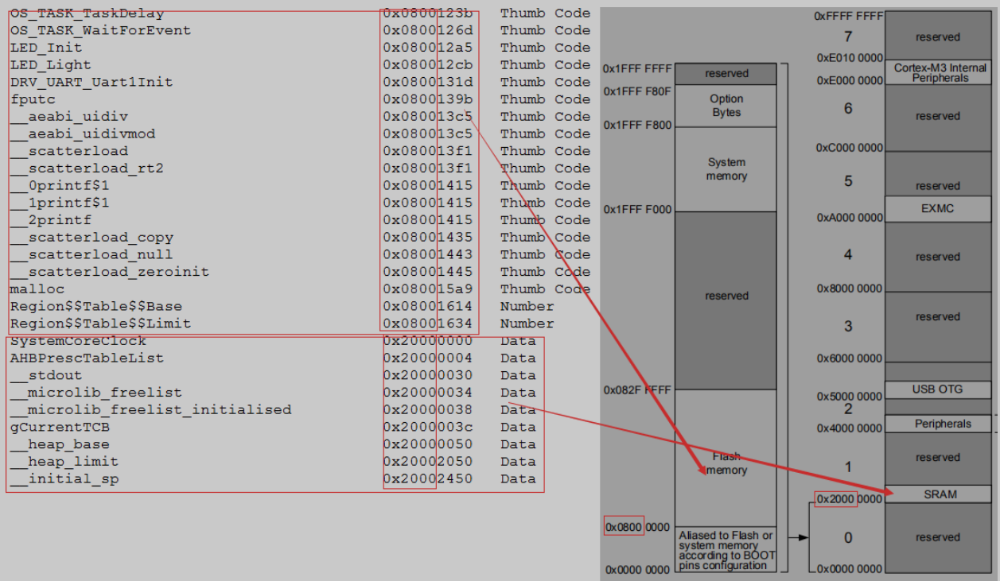

2. 把编译好的bin文件烧录到CPU上，CPU发生了什么？

   答：烧录过程，只是把bin文件完整的写入到Flash上而已

3. 上电后，CPU又产生了什么变化？

   答：

   1. 从CPU的起始地址开始，如图，M3内核的CPU会从0x00000004开始运行代码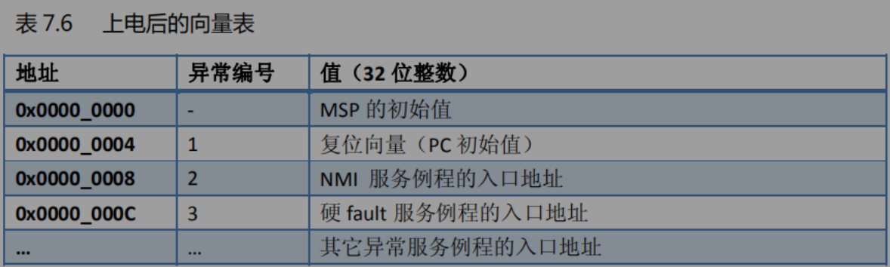
   2. 图中示范了一个最简单的例子，每步的执行，实际只是PC指针的调整和相应寄存器赋值取值的过程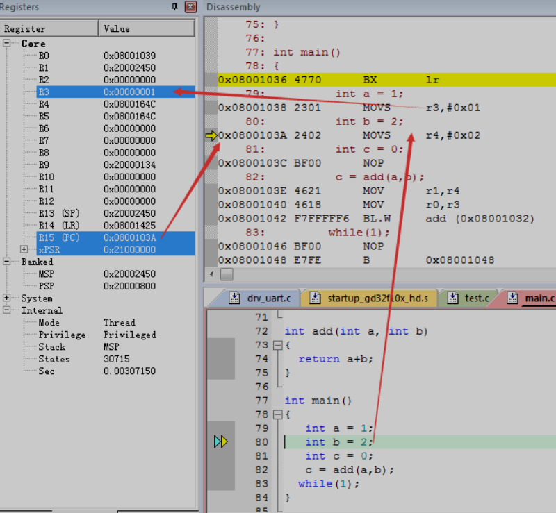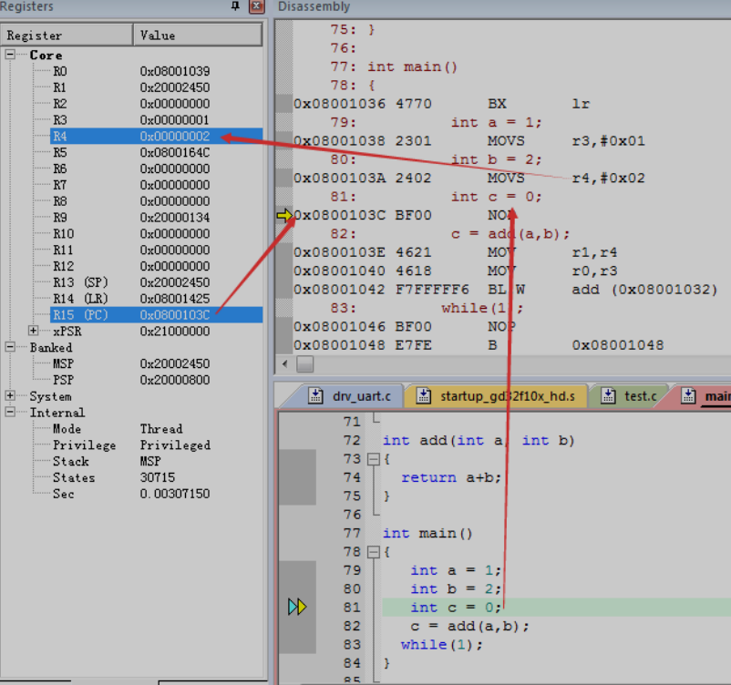

4. 上面的例子可以理解，单个任务时CPU是如何运作的，那么当多个任务时，我们只要把上面用到的寄存器和堆栈，每个任务复制一份，独立存储访问，然后切换PC指针和堆栈指针就可以完成任务的调度切换。如下图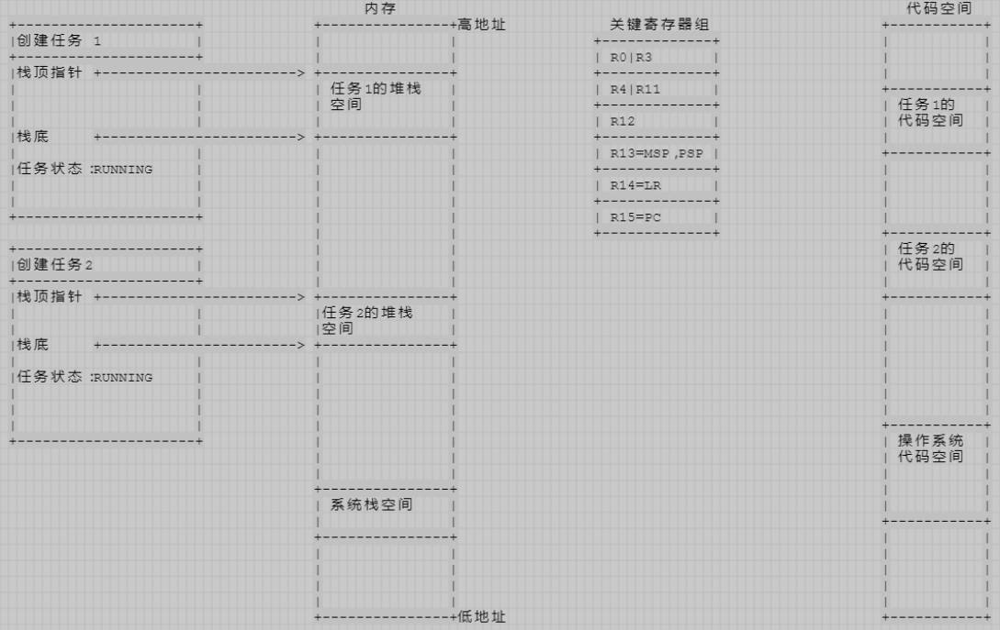

   

### OS设计说明

#### 1. 任务状态切换

如下图，任务必须严格按这三个状态切换

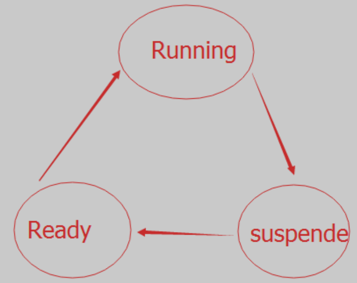

#### 2. 任务创建流程

1. 该代码运行在系统特权级线程模式，堆栈使用MSP
2. 申请任务控制块
3. 申请堆栈内存，并赋值栈顶指针，注意：malloc的内存返回地址是内存的起始地址，而堆栈是向下生产的，所以栈顶指针赋值时必须加上堆栈深度
4. 初始化堆栈空间，必须严格按Cortex M3的入栈要求执行
5. 任务状态置为ready

```c
static StackSize_t* TASK_TaskStackFirstInit(IN StackSize_t *topStack, IN TaskFunction_t func)
{
    /* 按堆栈地址顺序入栈，而非寄存器入栈顺序
     * PSR,PC,LR,R12,R3,R2,R1,R0 以上是芯片自动入栈的
     * R4,R5,R6,R7,R8,R9,R10,R11 以上手工入栈，入出栈顺序注意保持一致
     * 此处也可以增加计数，用于堆栈溢出检查
     */
    topStack--;
    *topStack = OS_TASK_INITIAL_XPSR;
    topStack--;
    *topStack = (((StackSize_t)func) & OS_TASK_START_ADDRESS_MASK);
    topStack--; /* 任务栈初次初始化，已是最上层了，返回即错，因此可以增加返回函数用户调试 */
    topStack -= 5; /* 可用于函数入参 */
    topStack -= 8;
    return topStack;
}

S32 OS_TASK_CreateTask
(
    IN U8 id, 
    IN TaskFunction_t taskHandle, 
    IN U16 taskStackDeep, 
    IN U32 *eventBitMap
)
{
    TCB_S *newTcb = NULL;
    StackSize_t *topStack = NULL;
    
    if (id >= OS_TASK_MAX)
    {
        return OS_ERROR;
    }
    
    newTcb = (TCB_S*)malloc(sizeof(TCB_S));
    if (NULL == newTcb)
    {
        return OS_ERROR;
    }
    
    newTcb->state = TASK_INIT;
    topStack = (StackSize_t *)malloc(sizeof(StackSize_t)*taskStackDeep);
    if (NULL == topStack)
    {
        return OS_ERROR;
    }
    topStack += sizeof(StackSize_t)*taskStackDeep;

    newTcb->topStack = TASK_TaskStackFirstInit(topStack, taskHandle);
    
    newTcb->state = TASK_READY;
    newTcb->delay = 0;
    newTcb->delayMax = 0;
    newTcb->eventBitMap = eventBitMap;
    newTcb->id = id;

    gTaskTcbList[id] = newTcb;
    
    return OS_OK;
}
```


#### 3. 任务首次调度流程

​	该流程的目的是把CPU的控制权，有特权级线程模式切成用户级线程模式，根据OS原理分析得知，需要做如下处理

1. 找到当前优先级最高且处于Ready状态的任务，即gCurrentTCB指向的任务

2. 触发svc 0，进入SVC中断，此时处于handler模式

3. PSP指向当前任务的堆栈指针

4. 利用LR寄存器异常返回特性，返回到线程模式使用线程堆栈，完成CPU控制权交接给当前任务，如图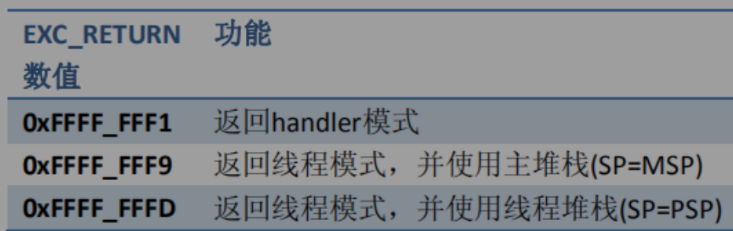

   ```c
   __asm static VOID TASK_SvcHandler(VOID)
   {
       extern gCurrentTCB;
   
       /* 任务相关内容映射到入线程栈 */
   	ldr	r3, =gCurrentTCB
   	ldr r1, [r3]
   	ldr r0, [r1]
   	ldmia r0!, {r4-r11}
       msr psp, r0
       isb
   
       /* 利用LR寄存器异常返回进入线程模式特性 */
   	mov r14, #0xfffffffd
   	bx r14
       nop
   }
   
   void SVC_Handler(void)
   {
       TASK_GetCurrentTask();
       TASK_SvcHandler();
   }
   
   __asm static VOID TASK_StartFirstTask(VOID)
   {
       /* 触发svc，在svc中断中通过修改LD寄存器值的方式进入线程模式 */
       svc 0
       nop
       nop
   }
   
   VOID OS_TASK_SchedulerTask(VOID)
   {   
       TASK_StartFirstTask();
       return;
   }
   
   ```


#### 4. 任务调度切换流程

​	当存在多个任务时，每隔任务都需要轮流取得CPU控制权，从而达到并行运作的效果，目前设计的是每隔10ms切换一次，实现流程如下：

1. 配置systick为1ms触发一次中断
2. 每10ms触发一次PendSV中断，使用PendSV进行任务上下文切换可以完美避开中断中发生任务切换的问题，必须注意：PendSV中断优先级必须最低
3. PendSV中断中，做如下事情
   1. 把当前任务入栈,主要是R4-R11，因为其它已自动入栈
   2. 切换任务上下文，注意堆栈保存，R3, r14需要重新恢复
   3. 使用新任务栈返回

```c
#define TASK_NVIC_INT_CTRL_REG		( * ( ( volatile uint32_t * ) 0xe000ed04 ) )
#define TASK_NVIC_PENDSVSET_BIT		( 1UL << 28UL )
/* ICSR寄存器bit28置1，触发PendSV中断 */
#define OS_TASK_SWITCH  TASK_NVIC_INT_CTRL_REG = TASK_NVIC_PENDSVSET_BIT

VOID SysTick_Handler(VOID)
{
    TASK_DelayList(); /* 本例中忽略 */
    TASK_WaitForEventList(); /* 本例中忽略 */
    gTaskSysTickCount++;
    if ((gTaskSysTickCount%OS_TASK_SWITCH_INTERVAL) != 0)
    {
        return;
    }

    OS_TASK_SWITCH;
}

__asm VOID PendSV_Handler(VOID)
{
    extern gCurrentTCB;
    extern TASK_GetCurrentTask;
            
    /* 把当前任务入栈,主要是R4-R11，因为其它已自动入栈 */
    mrs r0, psp
    isb
    stmdb r0!, {r4-r11}
    dsb
    isb

    /* 把堆栈地址映射到TCB */
    ldr r3, =gCurrentTCB
    ldr r2, [r3]  /* r2 = gCurrentTCB*/
    str r0, [r2]  /* 把r0赋值给gCurrentTCB->topStack */

    /* 切换任务上下文，注意堆栈保存，R3, r14需要重新恢复*/
    stmdb sp!, {r3,r14}
    dsb
    isb
    bl TASK_GetCurrentTask
	ldmia sp!, {r3,r14}
    dsb
    isb

    /* 获取新任务栈 */
	ldr r1, [r3]
	ldr r0, [r1]
	ldmia r0!, {r4-r11}
    dsb
    isb
    msr psp, r0
    isb

	bx r14
    nop
}
```


#### 5. 任务超时阻塞等待流程

​	经常需要某任务等待一段时间后再继续运行，即延时，其中等待的这段时间内，其它任务可以运行，从而充分利用CPU资源，流程如下：

1. 保存需要等待的时间到任务控制块中，任务状态置成SUSPENDED，并释放CPU控制权

2. 在systick 中断中，轮询每个任务，检测是否超时，

   1. 如果超时，则将任务状态置成READY，触发调度
   2. 如果没有到时间，则状态保持SUSPENDED

   ```c
   VOID OS_TASK_TaskDelay(IN U16 ms)
   {
       if ((0 == gCurrentTCB->delay) && (0 == gCurrentTCB->delayMax))
       {
           gCurrentTCB->delayMax = ms;
           gCurrentTCB->delay = gTaskSysTickCount;
           gCurrentTCB->state = TASK_SUSPENDED;
           OS_TASK_SWITCH;
       }
   }
   
   static VOID TASK_DelayList(VOID)
   {
       volatile TCB_S *tmpTcb = NULL;
       U8 id = 0;
   
       for (id = 0; id < OS_TASK_MAX; id++)
       {
           tmpTcb = gTaskTcbList[id];
           if (NULL == tmpTcb)
           {
               continue;
           }
           
           if (tmpTcb->delayMax != 0)
           {
               if ((gTaskSysTickCount - tmpTcb->delay) >= tmpTcb->delayMax)
               {
                   tmpTcb->delay = 0;
                   tmpTcb->delayMax = 0;
                   tmpTcb->state = TASK_READY;
                   OS_TASK_SWITCH;
                   return;
               }
               else
               {
                   tmpTcb->state = TASK_SUSPENDED;
               }
           }
       }
       
       return;
   }
   ```


#### 6. 任务事件阻塞等待流程

​	经常会遇到这样的需求，一个任务期待在另一个任务触发了某事件后，才执行后续操作，在等待期间，CPU控制权由其他任务占用，提供CPU利用率。流程如下：

1. 事件需要用户申请一个U32类型的全局变量，注意是位图，在任务创建时，填入到任务创建接口的eventBitMap参数，注意，必须传地址。`extern S32 OS_TASK_CreateTask(IN U8 id, IN TaskFunction_t taskHandle, IN U16 taskStackDeep, IN U32 *eventBitMap);`

2. 在当前任务中需要等待的地方，调用OS_TASK_WaitForEvent函数等待，当事件满足时，该函数后面的代码才会被执行

3. OS会在在systick 中断中，轮询每个任务，检测是否收到事件，

   1. 如果收到，则任务状态置成READY，并触发任务切换
   2. 如果没收到，则继续保持SUSPENDED状态

   ```c
   VOID OS_TASK_WaitForEvent(VOID)
   {
       if (NULL == gCurrentTCB->eventBitMap)
       {
           return;
       }
       
       if (0 == *gCurrentTCB->eventBitMap)
       {
           gCurrentTCB->state = TASK_SUSPENDED;
           OS_TASK_SWITCH;
       }
   }
   
   static VOID TASK_WaitForEventList(VOID)
   {
       volatile TCB_S *tmpTcb = NULL;
       U8 id = 0;
   
       for (id = 0; id < OS_TASK_MAX; id++)
       {
           tmpTcb = gTaskTcbList[id];
           if (NULL == tmpTcb)
           {
               continue;
           }
           
           if (NULL == tmpTcb->eventBitMap)
           {
               continue;
           }
           
           if (*tmpTcb->eventBitMap != 0)
           {
               tmpTcb->state = TASK_READY;
               OS_TASK_SWITCH;
           }
           else
           {
               tmpTcb->state = TASK_SUSPENDED;
           }
       }
   }
   ```


#### 7. 任务优先级设计

​	任务总有先后，优先级必不可少，期望当多个任务都进入READY时，可以优先执行优先级最高的任务，当最高优先级的任务转为SUSPENDED状态后，在执行次优先级的任务，用如此简单的设定实现优先调度的目的，如下：

1. 在任务切换，获取任务上下文时，会调用下面的函数，该函数会从头开始变量任务，找到第一个READY状态的任务，使它进入RUNNING状态，获取CPU控制权。

2. 可见，优先级同任务ID，ID越小优先级越高

   ```c
   VOID TASK_GetCurrentTask(VOID)
   {
       volatile TCB_S *tmpTcb = NULL;
       U8 id = 0;
   
       for (id = 0; id < OS_TASK_MAX; id++)
       {
           tmpTcb = gTaskTcbList[id];
           if ((TASK_READY == tmpTcb->state) || (TASK_RUNNING == tmpTcb->state))
           {
               tmpTcb->state = TASK_RUNNING;
               gCurrentTCB = tmpTcb;
               break;
           }
       }
       
       return;
   }
   ```


### 需要储备以下知识

1. 熟悉CPU架构
2. 熟悉指令集
3. 熟悉操作系统原理

### 参考资料

《Cortex-M3权威指南Cn.pdf》

《GD32F10xCH_V1.1.pdf》

